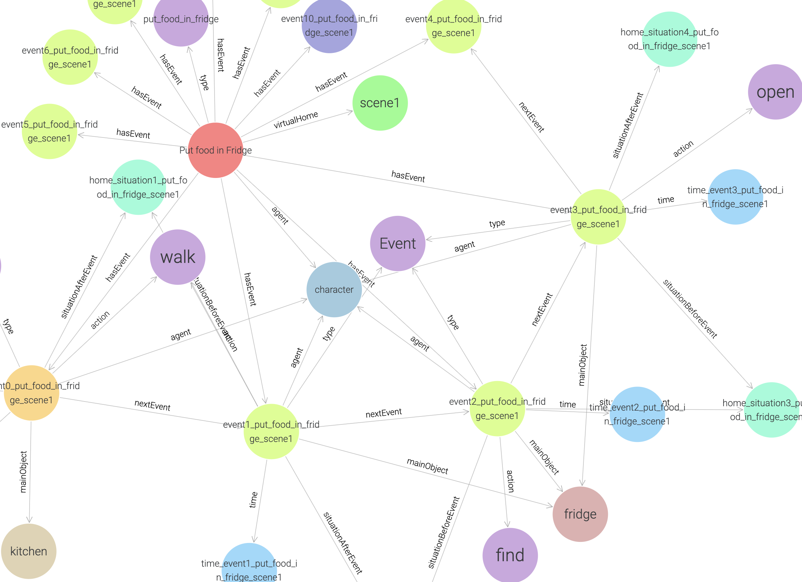

MAI@Home ("Multimodal AI Reasoning Challenge @Home") is a multimodal Embodied-AI competition proposed at ICRA '25. Here, AI systems are challenged to reason on multi-time spatiotemporal QA tasks in a daily living environment where your host human continuously changes the environment slightly. 
In this competition, submitted systems must process not only the current status but also have to “remember” and manage the status of the complex and dynamic environment, a crucial aspect for practical applications in the real world.  
One unique feature of this competition is that we provide spatiotemporal knowledge graphs and scene graphs in addition to the video footage, which can be considered a partial observation database that the agents can refer to as external knowledge.
  
For more information you can check out the <a href="http://ikgrc.org/2025/">competition website</a> and the github.
  
In the notebook below you can try out some example queries on the knowledge graph and video data

  
  For Detailed information click
  <a class="btn btn-success" target="_blank" href="maihome-competition"><b>here!</b></a>

<!--more-->

   

   

## References
1. https://github.com/KnowledgeGraphJapan/KGRC-RDF/tree/kgrc4si
2. https://ikgrc.org/2025/rdf.html