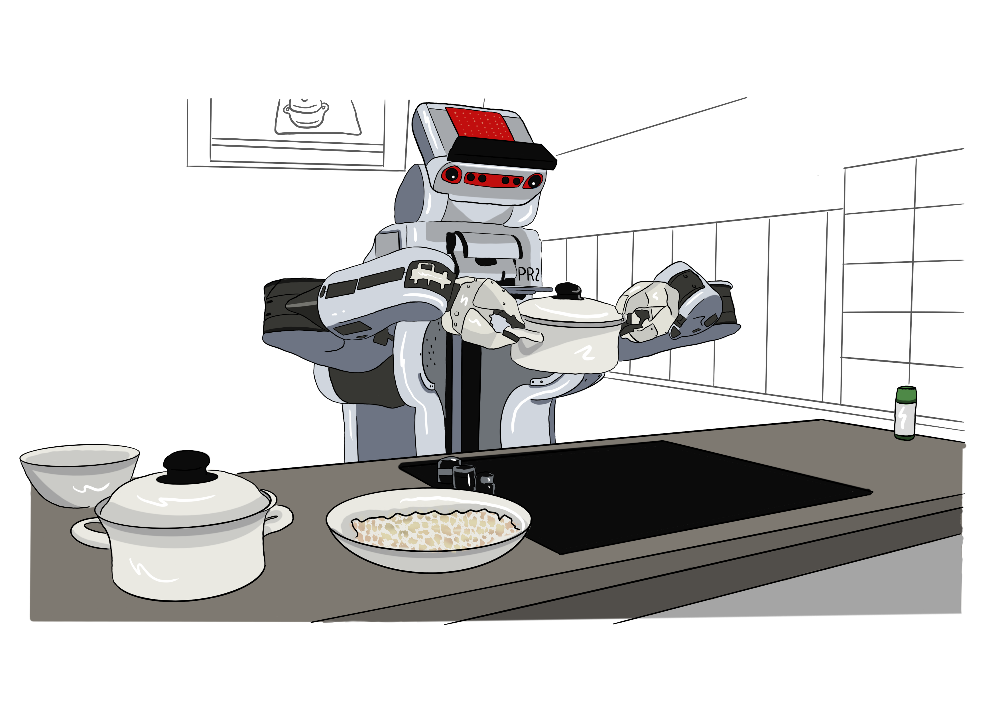
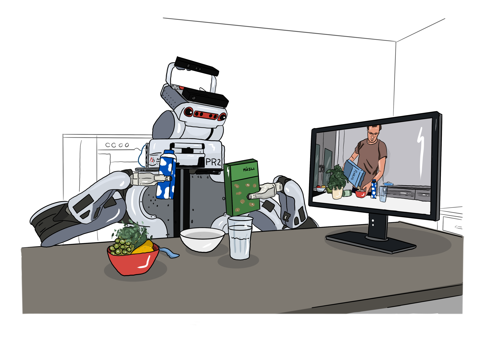
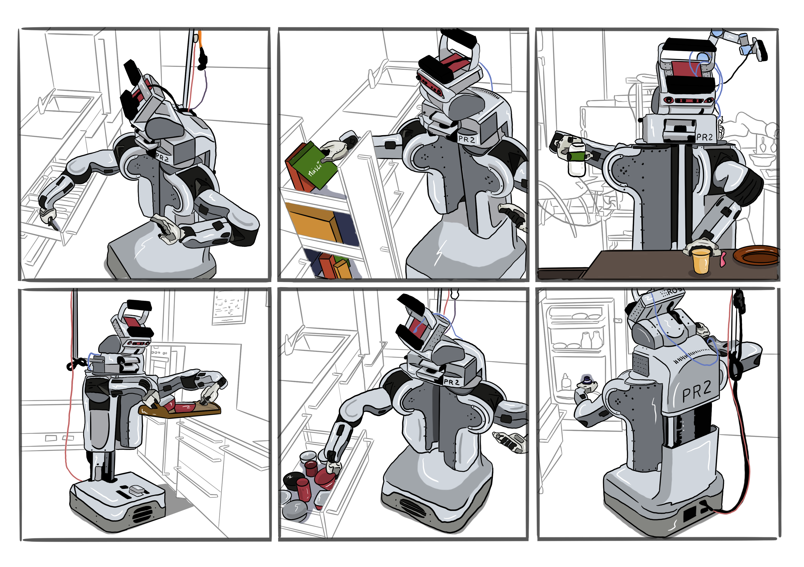
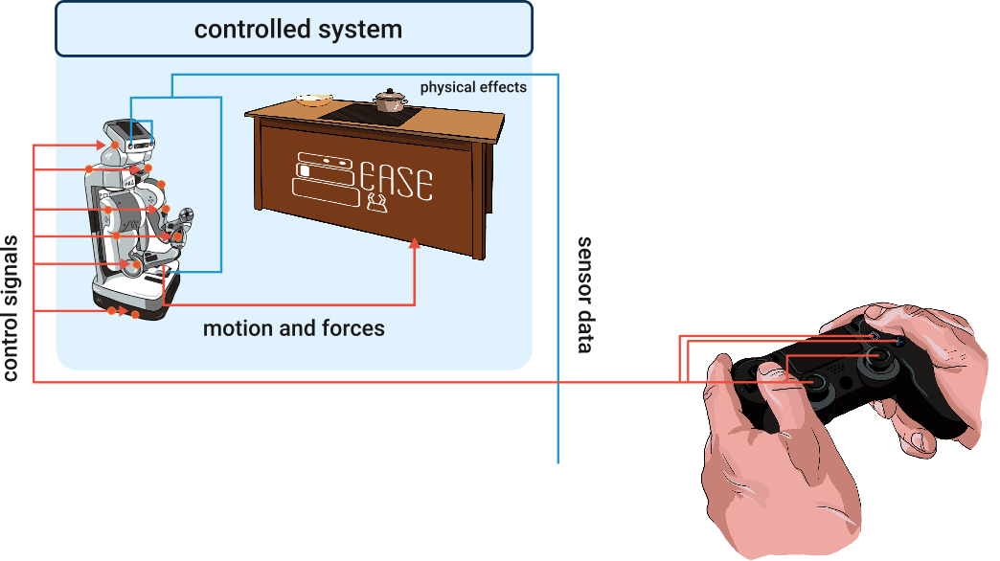

  In our innovative Virtual Research and Training Building (ViB) we aim at providing convenient open access to our research infrastructure for AI-powered and cognition-enabled robotics through our ViB. Researchers worldwide can access the ViB to conduct research in virtual labs with digital twin robots and their control software, and household and retail experimental environments, as well as virtual knowledge labs and everyday activity labs.

  

    The virtual research building for AI-based and cognition-enabled robotics serves as a dynamic hub for innovation and exploration in the field. 
    Within this digital environment, researchers have access to virtual research laboratories that are meticulously designed as digital twins of real-world research facilities, 
    mirroring their layout, equipment, and capabilities. Researchers can immerse themselves in these virtual spaces, leveraging cutting-edge technologies to conduct experiments, 
    simulate scenarios, and develop novel algorithms for robotic systems.  
  

  

    
  

  

    At the heart of the virtual research building lies an operating environment tailored to support a wide range of research endeavors. 
    Here, researchers can interact with virtual robots, manipulate their configurations, and deploy software algorithms seamlessly.
    The environment is highly adaptable, allowing researchers to simulate various environmental conditions, test different control strategies,
    and evaluate the performance of AI-based algorithms in diverse scenarios. By running the research labs as Docker software containers,
    researchers can easily access and manage their experiments, fostering collaboration and reproducibility across different projects.  
  

  

    
  

 

  

    The overarching research mission of the virtual building is to advance the frontiers of AI-based and cognition-enabled robotics through experimentation, 
    innovation, and knowledge sharing. By providing a flexible and accessible platform for conducting research, the virtual building accelerates the pace of
    discovery and facilitates interdisciplinary collaboration among researchers from around the globe. It serves as a catalyst for breakthroughs in robotics technology, 
    driving progress towards the development of intelligent, autonomous systems capable of navigating complex real-world environments and solving a wide range of practical challenges.
  

 

    
  

 

  

    The virtual research building is a key component of the European Robotics Collaboration Repository (EUROCORE) of the European Network of Excellence Centers in robotics euRobin. It is supported through the Collaborative Research Cluster Everyday Activity Science and Engineering (EASE), the ERC Advanced Grant FAME (Future-oriented Cognitive Action Modelling Engine).
  

 

    
  

