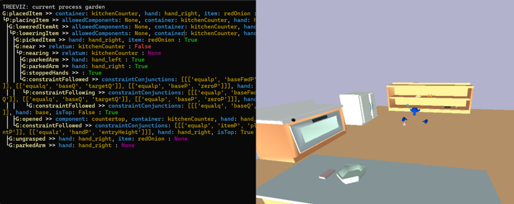
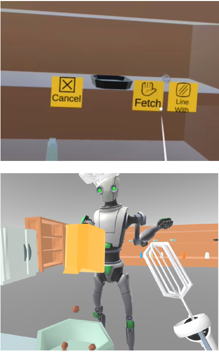

The MUHAI Kitchen Affordances Simulator was developed as part of a larger effort by the MUHAI project to benchmark natural language understanding software by parsing recipes into executable robot actions. As such, it features a very simplified robot -- e.g. its hands float in the air and can travel quite far from its head, to simplify inverse kinematics.

   
  The MUHAI Kitchen Simulator. Left side shows a display of the current behavior tree of the robot. Right side shows an overview of a salad preparation scene.

On the other hand, the simulator implements various object behaviors that are needed for cooking tasks but go beyond rigid body simulation: fruits can be cut, peeled, or seeded, particles of various substances can be sprinkled upon various surfaces, mixtures of substances change to become new substances etc.

The knowledge modelling for the simulator makes use of the SOMA model of affordances, in particular by treating objects as having "dispositions" which inform what "custom dynamics" they can participate in. It is via these custom dynamics that phenomena beyond rigid body motion are implemented. For example, if an object has the cuttable disposition, it can be cut if an object with the canCut disposition moves in an appropriate way in its vicinity. Most of these affordances are similarly triggered by relative motions of other objects, rather than by the agent emitting a command to the environment.

<param class="hidde-after-preview">

Several hundred kinds of objects are available to populate scenes with, and the robot in the simulation -- "Abe" -- can respond to over 40 commands such as transporting, pouring, cutting, covering, peeling etc. These commands are sent to the robot via an HTTP POST interface.

Besides the benchmark and related NLU work, the simulator has been used in a combination with a VR interface. In the latter use case, an avatar of the human user is mirrored in the simulator and can interact with the world. The human avatar can also send commands to the robot via an affordance-based menu, where objects reveal to the user what sorts of actions they may participate in.

   
  VR and the kitchen simulator. Top: affordance menu. Bottom: human and robot avatars in VR. Note that the robot avatar presented to the human looks different than the model used by the kitchen simulator.

You can access the kitchen simulator at <a class="btn btn-success" target="_blank" href="https://github.com/muhai-project/abe_sim"><b>the project repository</b></a>.
The repository provides installation instructions -- the simulator can run on Unix, Windows, and (with some work) on MacOS systems -- as well as some example scenarios showing the simulator in action.

Unfortunately, as it uses OpenGL, the simulator is not yet available to use over Jupyer Lab. Therefore, if you wish to try it out you will need to git clone the repo and try it locally on your machine for now.

---

---

Publications
---
- [Jens Nevens, Robin De Haes, Rachel Ringe, Mihai Pomarlan, Robert Porzel, Katrien Beuls, Paul Van Eecke, "A benchmark for recipe understanding in artificial agents". Joint international conference on Linguistics, Language Resources, and Evaluation (LREC). 2024]()

- [Stefan Morar, Mihai Pomarlan, Adrian Groza, "Formalizing Natual Language Quantifiers for Human-Robot Interactions". 9th International Workshop on Artificial Intelligence and Cognition (AIC). 2023]()

