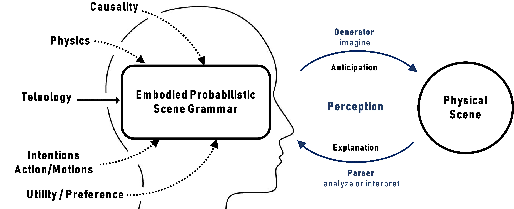

In this laboratory, we investigate the role of common sense in perception because we want to find out what prospective machinery efficiently drives our interpretation of the world to show how to overcome the high uncertainty resulting from the severe temporal, spatial and informational limitations in sensor data as the embodied agent interacts with its environment. Perception in such complex scenes (e.g., safety-critical, dynamic) does not only goes beyond processing sensor data to address classical tasks such as object classification, usually known as the what- and where-object-questions, but also faces the what-, how-, and why-happen-questions (e.g., task execution verification, estimation of physical parameters, quantities and detection of states such as fullness, stability). We generalize the problem of perception by placing events instead of objects at the center of scene understanding, where perception takes place as a loop which consists in predicting on the one hand the effects (anticipation) and on the other hand the causes (explanation) of events.

<a class="btn btn-success" target="_blank" href="https://github.com/NaivPhys4RP">Source Code</a>

  For Detailed information click
  <a class="btn btn-success" target="_blank" href="naivphys4rp-dark-perception-laboratory"><b>here!</b></a>

<!--more-->

<!-- 

  

      
  

  

    <h3>Replace with Name</h3>
    Tel:     +49 XXXXXXXXXX  
    Fax:     +49 XXXXXXXXXX  
    Mail:    <a href="mailto:XXXXXXX@cs.uni-bremen.de">XXXXXX@cs.uni-bremen.de</a>  
    <a style="color:red" href="https://ai.uni-bremen.de/team/XXXXXXXXX">
      Profile
    </a>
  

 -->

Description
---
NaivPhys4RP (Naive Physics for Robot Perception) is a causal and transparent generative perception model that emulates human perception by capturing key aspects of human common sense, formulated and coined in this work under the term Probabilistic Embodied Scene Grammars (PESG), that invisibly (dark) drives our interpretation of the world from poor observations. Note that PESG constitutes the foundations of NaivPhys4RP and enables it to probabilistically emulate the way the physical scene evolves and adjust these emulations with the few available sensor data (e.g., if we are in the desert, we can imagine entities that can be found there, and if this moves it is likely a carmel). 

In highlighting the high uncertainty from sensor data in complex worlds, NaivPhys4RP first point the necessity to generalize scene understanding and center it around events instead of objects, handling what/how/why-happen-queries (e.g., task execution verification, physical parameters, quantities, states such as fullness, stability) instead of just what/where-queries (e.g., object detection). Then, NaivPhys4RP regards perception as a loop consisting on the one hand of anticipatory queries where anticipation makes use of PESG to look ahead and predict the consequences of events (e.g., would glass spill when pouring? or what is the image resulting from the observation of a half full glass?). This can be seen as generating more information through PESG to augment sensor data. On the other hand, explanatory queries for which explanation looks back and predicts the causes of events (e.g., how full should the glass be for it to be observed as such?). This can be seen as parsing evidences through PESG. Mathematically, NaivPhys4RP computes a Contextual Partially-Observable Markov Process with Decision (CPOMP-D). In such a particular POMP, though the scene state is the central target, the decision making of agents in the scene is also modeled since the perceiving agent can decide to act mentally without actually realizing the action phyically (e.g., deciding actions from context and imagining them). The figure below illustrates PESG and its superiority to natural language grammars.

Core Inference Tasks - Anticipation and Explanation through Cognitive Emulation (Imagination)
---
This video demonstrates the application of NaivPhys4RP for the learningless and safe recognition and 6D-pose estimation of (transparent) objects.
<figure class="video_container">
  <iframe width="560" height="315" src="https://www.youtube.com/embed/kYGVylYddAo?si=iv3DZqGdhy7VxrI9" title="YouTube video player" frameborder="0" allow="accelerometer; autoplay; clipboard-write; encrypted-media; gyroscope; picture-in-picture; web-share" referrerpolicy="strict-origin-when-cross-origin" allowfullscreen></iframe>
</figure>

Learning to Imagine in NaivPhys4RP - Amortization (Speeding up and Narrowing Imagination)
---
Despite the considerable reduction of the world state space through context-specific imagination, still there remains a bit of vagueness for instance in terms of number of objects and concrete spatial configurations. In order to amortize this combinatorial explosion, we employ a greedy direct (unconscious) perception approach of the scene, neurally trained on imagined datasets, to compress the state space. Then, the optimistic results of the neural learner are filtered based on the context and available sensor data (e.g., if knife detected then likely spoon because coffee drinking). We developed RobotVQA in this regard. 
<figure class="video_container">
<iframe width="560" height="315" src="https://www.youtube.com/embed/zAnwgnKpN-U?si=BjtlojmhC8xZ29Sw" title="YouTube video player" frameborder="0" allow="accelerometer; autoplay; clipboard-write; encrypted-media; gyroscope; picture-in-picture; web-share" referrerpolicy="strict-origin-when-cross-origin" allowfullscreen></iframe>
</figure>

Safety with NaivPhys4RP - Trace, Verifiy, (Recover,) Report
---
RobAuditor is a safety-centric wrapper of NaivPhys4RP and flexible framework for automated task execution verification and audit trail generation in safety-critical processes  which performs 1) task execution verification, (2) audit trail generation, and (3) failure recovery and prevention while scaling to (a) the diversity of task execution structures, (b) diversity of task execution contexts and (c) the availability of computational resources.
 
<figure class="video_container">
<iframe width="560" height="315" src="https://www.youtube.com/embed/Pzo4AQhzb9o?si=3eZwe1LOLGnl4voi" title="YouTube video player" frameborder="0" allow="accelerometer; autoplay; clipboard-write; encrypted-media; gyroscope; picture-in-picture; web-share" referrerpolicy="strict-origin-when-cross-origin" allowfullscreen></iframe>
</figure>

Perception of Flexibles in NaivPhys4RP - Generative Models of Fluids [Coming soon]
---

The model allows agents, manipulating fluids (e.g., pouring), to answer difficult perceptual queries such as how full is the container, whether the container will spill or whether the container will be missed.

<figure class="video_container">
<iframe width="560" height="315" src="https://www.youtube.com/embed/jIuagFW5xiI?si=DrZybzpozjerxEVp" title="YouTube video player" frameborder="0" allow="accelerometer; autoplay; clipboard-write; encrypted-media; gyroscope; picture-in-picture; web-share" referrerpolicy="strict-origin-when-cross-origin" allowfullscreen></iframe>
</figure>

Interactive Actions and/or Examples
---

<a class="btn btn-success" target="_blank" href="https://github.com/NaivPhys4RP/">Source Code</a>

Publications
---

- [F. Kenghagho K., F. Balint-Benczedi, F. A. Siddiky, M. Beetz, "RobotVQA: A Scene-Graph- and Deep Learning-based Visual Question Answering System for Robot Manipulation Tasks", 2020 IEEE International Conference for Intelligent Robot Systems (IROS).](https://ieeexplore.ieee.org/document/9341186)

- [P. Mania; F. Kenghagho. K; M. Neumann; M. Beetz, "Imagination-enabled robot perception", 2021 IEEE/RSJ International Conference on Intelligent Robots and Systems (IROS).](https://ieeexplore.ieee.org/abstract/document/9636359)

- [F. Kenghagho K.; M. Neumann; P. Mania; T. Tan; F. A. Siddiky; R. Weller; G. Zachmann; M. Beetz, "NaivPhys4RP - Towards Human-like Robot Perception: "Physical Reasoning based on Embodied Probabilistic Simulation"", 2022 IEEE International Conference on Humanoid Robots (Humanoids).](https://ieeexplore.ieee.org/document/10000153)

- [F. Kenghagho K.; M. Neumann; P. Mania; M. Beetz, "Perception through Cognitive Emulation: "A Second Iteration of NaivPhys4RP for Learningless and Safe Recognition and 6D-Pose Estimation of (Transparent) Objects from Poor Sensor Data"", 2024 International Conference on Robotics and Automation (ICRA).](https://ieeexplore.ieee.org/document/10610037)

- [F. Kenghagho K.; J.B. Weibel; S. Aloui; M. Prada; M. Neumann; M. Grossard; A. Remazeilles; M. Vincze; M. Beetz, "RobAuditor: A Flexible Framework for Automated Verification and Audit Trail Generation in Safety-Critical Processes: "Plug, Trace, Verify, (Recover,) Report"", 2024 IEEE International Conference on Humanoid Robots (Humanoids). Submitted](https://www.researchgate.net/publication/379310647_RobAuditor_-_A_Highly_Scalable_Framework_for_Automated_Verification_and_Audit_Trail_Generation_in_Mission-Critical_Processes_When_robots_understand_what_they_see_and_do_then_give_account_of)

- [G. Kazhoyan; S. Stelter; F. Kenghagho K.; S. Koralewski; M. beetz, "The Robot Household Marathon Experiment", 2021 International Conference on Robotics and Automation (ICRA).](https://ieeexplore.ieee.org/document/9560774)

- [B. Alt; F. Kenghagho K.; A. Haidu; D. Katic; R. Jäkel; M. Beetz, "Knowledge-driven robot program synthesis from human VR demonstrations", 2023 International Conference on Principles of Knowledge Representation and Reasoning (KR).](https://dl.acm.org/doi/10.24963/kr.2023/4)

