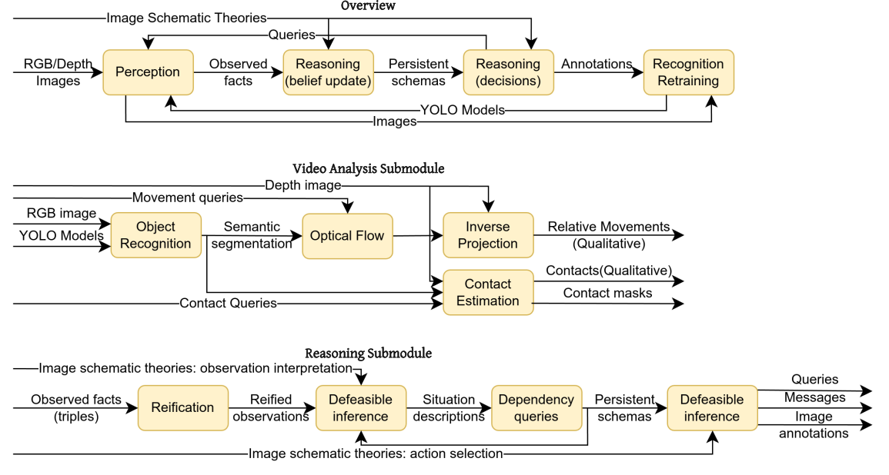
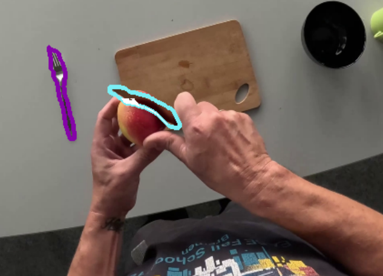
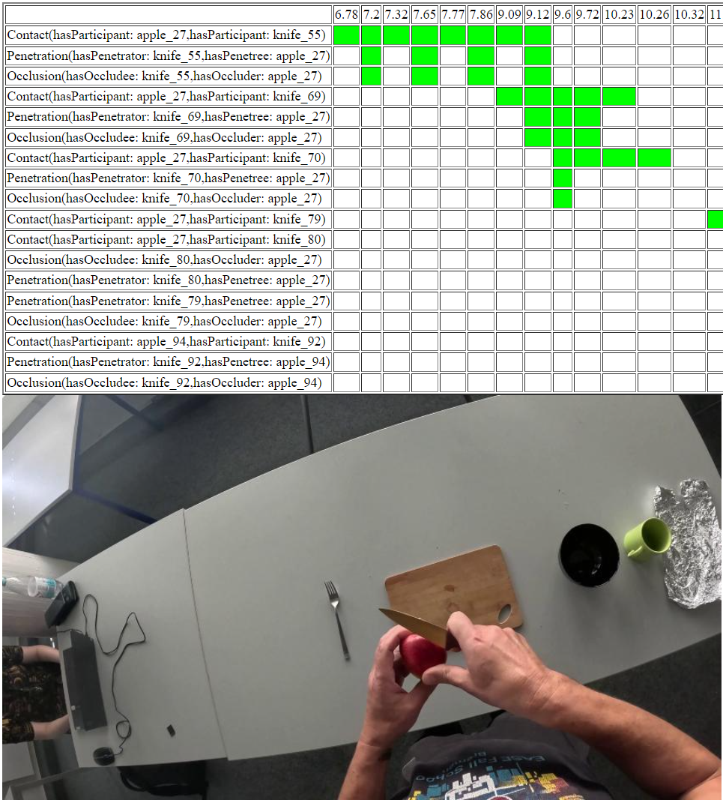

Human beings are able to partition the world in flexible ways such that handling a task at hand is made easier. We don't always notice cup handles, but when we need them, we do. In a pinch, we might also notice the edge of the cup if we need to cut a sheet of dough into a pattern and nothing else is available. And if we observe someone cutting a sheet of dough with a cup, we would also notice subevents such as the person grabbing the cup, rotating it face down, pressing it into the dough etc.

While we could train artificial agents to recognize such parts based on pre-annotated sets, or trust large scale foundational models to come up with creative partitions on the fly, it may also be interesting to look at this problem in a more principled in transparent way: how can perception mechanisms be arranged such that they can create new concepts for object and event parts based on observations of real events and objects?

  For Detailed information click
  <a class="btn btn-success" target="_blank" href="semanticeventsegmentation"><b>here!</b></a>

<!--more-->

We present here our initial steps in this direction: a perception module that combines classical machine vision, deep learning, and reasoning, to create a system that is able to:

- recognize semantically relevant parts of events, based on a logical description of what is semantically relevant;

- recognize functionally relevant parts of objects, based on a logical description of what counts as functionally relevant;

- automatically select training data from an image stream to help identify object functional parts in the future, even outside of situations in which those parts are used; i.e., create new object classes for the perception system to track.

An overview of the system is provided in the figure below. More details can be found in the accompanying [paper](https://www.utwente.nl/en/eemcs/fois2024/resources/papers/pomarlan-et-al-hanging-around.pdf).
 

   
  The perception module overview, with some details on the video analysis and reasoning submodules.

As an example task, consider the identification of the part of an object that is central to making it a cutting tool -- a blade. We first would need a functional specification of such a thing, i.e. an answer to the question "if something is a blade, and is used as a blade, what would be observed?"

Our perception module allows tracking several things, such as contacts and occluded shapes, and so it is possible for it to be given the following instruction: the part of something that comes into contact with and is then occluded by another object is the blade. Obviously this is not a perfect description! We can make it a bit more precise by restricting what sort of objects we look at (e.g., we look for contacts between cutlery and fruit), and possibly also by specifying some other events that should occur beforehand. But once given this specification, via defeasible logic rules, the system can then adjust its inner perception pipeline to look for the contact, occlusion, etc. events and select parts of video frames which correspond to what the module thinks behaved like a blade. This works even for pixels of the blade that used to be inside the cut object -- we use shape registration to approximate occluded object shapes and later match them to un-occluded shapes again.

   
  Tracking the blade of a knife based on a simple functional description; white pixels are the part of the blade that used to be inside the apple in previous frames.

Our perception module also allows summarizing a video sequence into only a few frames at which image schematic relations between objects change: a contact is formed or lost, movement begins in a certain direction relative to an object, an occlusion begins or ends, etc. Which kinds of relations, between which kinds of objects, are to be tracked is also specified via defeasible logic rules. The summary of the video then consists of a set of frames and their associated knowledge graphs.

   
  Semantic event segmentation.

You can access the perception module at <a href="https://github.com/heideggerian-ai-v5/khafre"><b>the project repository</b></a>.
The repository provides installation instructions -- the module can run on Unix and Windows -- as well as some examples showcasing event and object semantic segmentation.

Unfortunately, as it uses OpenGL, this perception module is not yet available to use over Jupyer Lab. Therefore, if you wish to try it out you will need to git clone the repo and try it locally on your machine for now.
 
 

Publications
---
- [Mihai Pomarlan, Stefano de Giorgis, Rachel Ringe, Maria Hedblom, Nikolaos Tsiogkas, "Hanging Around: Cognitive Inspired Reasoning for Reactive Robotics". International Conference on Formal Ontology and Information Systems (FOIS). 2024](https://www.utwente.nl/en/eemcs/fois2024/resources/papers/pomarlan-et-al-hanging-around.pdf)

- [Stefano de Giorgis, Mihai Pomarlan, Nikolaos Tsiogkas, "ISD8 Tutorial Report: Cognitively Inspired Reasoning for Reactive Robotics - From Image Schemas to Knowledge Enrichment". Eighth Image Schema Day (ISD), at the Conference of the Italian Association for Artificial Intelligence (AI*IA). 2024](https://ceur-ws.org/Vol-3888/Tutorial_report.pdf)

