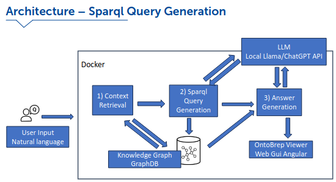

---
title: "Talk2YourKnowledgeBase Laboratory"
date: 2020-05-02T14:33:42-04:00
subtitle: ""
tags: ["Innovation"]
dropCap: false
displayInMenu: false
displayInList: true
draft: false
resources:
- name: ActionButtons
  src: "buttons.json"
---

The Talk2YourKnowledgeBase system from the <a href="https://www.fortiss.org/">fortiss research institute</a> research institute takes natural language input from the user, interpreting it through an interface that connects to a knowledge graph database. When a query is made, the system retrieves relevant context using this interface, ensuring that the response is informed by structured and symbolic data. 

To extract precise information, a SPARQL query is generated dynamically, leveraging both a large language model and the knowledge graph database itself. 
This query is then executed against the database, retrieving the most relevant facts and relationships. 
Once the data is gathered, the language model processes it, generating a well-formed answer that is coherent, context-aware, and human-readable. 
If the response contains geometric properties, e.g., regarding specific surfaces of an interaction object or an entity of an environmental description, it may be visualized in a web-based graphical interface, augmenting the generated natural language answer. This combination of communication modalities provides an intuitive and interactive way for the user to engage with the retrieved knowledge. 

The entire process runs seamlessly within Docker containers, ensuring consistency, scalability, and ease of deployment across different environments.

  For Detailed information click
  <a class="btn btn-success" target="_blank" href="talk2yourknowledgebase-laboratory"><b>here!</b></a>

<!--more-->

<h>**Showcase**:</h>
<figure class="video_container">
<iframe width="100%" height="480" src="https://www.youtube.com/embed/n_Zy8P5BCVE" title="Ontology-Based CAD Analysis with LLMs: Natural Language Querying of Boundary Representations" frameborder="0" allow="accelerometer; autoplay; clipboard-write; encrypted-media; gyroscope; picture-in-picture; web-share" referrerpolicy="strict-origin-when-cross-origin" allowfullscreen></iframe></figure>
