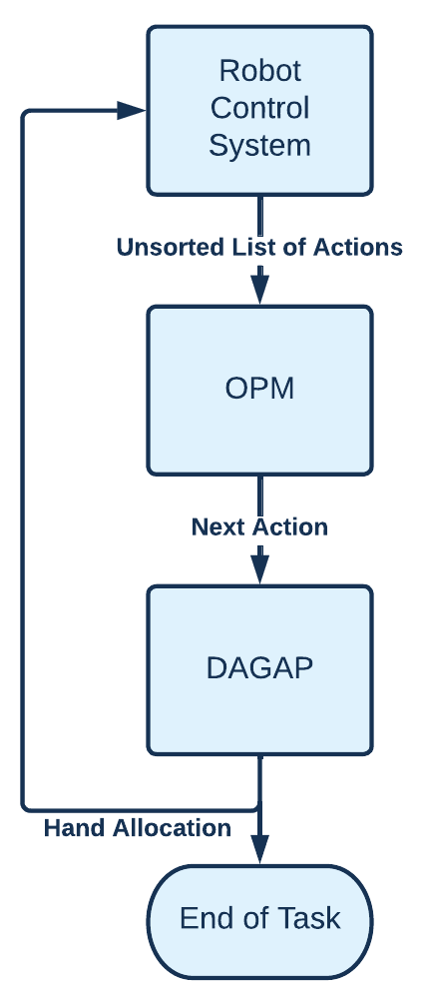
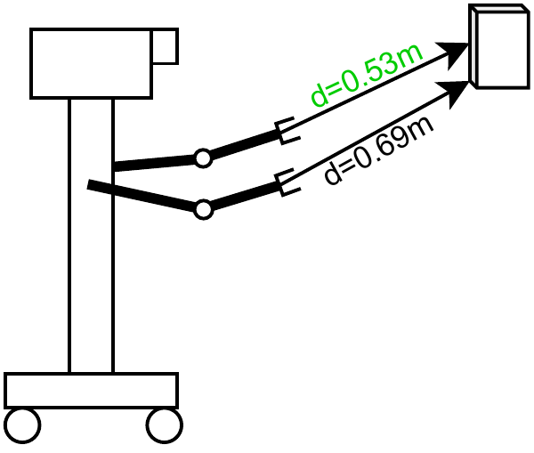
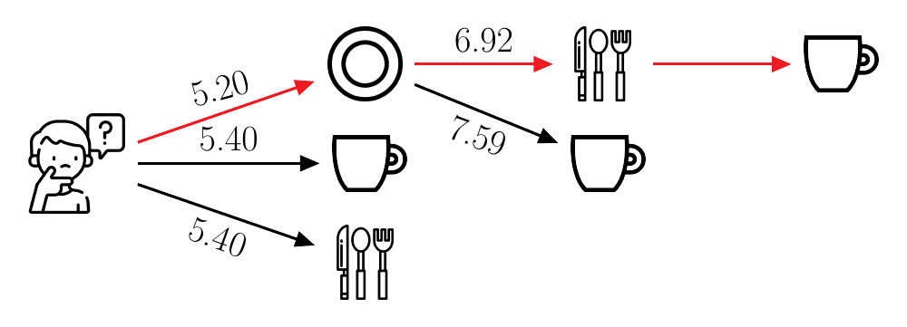

In the Dual Arm Manipulation & Decision Laboratory, you can observe the capabilities of a dual-arm robot performing table setting tasks under uncertainty.
This lab focuses on enhancing the decision-making skills of the robot while it interacts with various objects.
The ultimate goal is to develop a system that can intelligently adapt to changing environments and tasks, choosing its next action and which gripper to use autonomously based on several factors of its (spatial) environment. 

Currently, the lab showcases two heuristics: The Opportunistic Planning Model (OPM) for action selection, and the Dual-Arm Grasp Action Planner (DAGAP) which decides which gripper to use.

Here you can explore the table setting demo, create your own object order and experiment with it.

  For Detailed information click
  <a class="btn btn-success" target="_blank" href="the-dual-arm-action-selection-laboratory"><b>here!</b></a>

<!--more-->

<!-- 

  

      
  

  

    <h3>Replace with Name</h3>
    Tel:     +49 XXXXXXXXXX  
    Fax:     +49 XXXXXXXXXX  
    Mail:    <a href="mailto:XXXXXXX@cs.uni-bremen.de">XXXXXX@cs.uni-bremen.de</a>  
    <a style="color:red" href="https://ai.uni-bremen.de/team/XXXXXXXXX">
      Profile
    </a>
  

 -->

Description
---
Integrating heuristics into robot behavior allows to reduce the necessary effort when designing robot control programs: They can be used as modular additions enabling the robot agent to act autonomously, without requiring pre-programmed control structures on how to solve a specific task (i.e., with which hand to grasp an object or in which order to perform the individual actions of an activity such as cleaning up a room).
While a multitude of planning algorithms already exist, they do not provide efficient solutions for a task in which the sequence of actions is unconstrained, i.e., where all subtasks could be done in any order. By providing heuristics for such tasks, we aim to decrease the required effort when writing control programs for robot behavior: Instead of relying on pre-defined condition-action or precedence rules that need to be supplied by the user or programmer, our heuristics can be applied to any new task and environment, allowing the robot to act autonomously. Compared to a random order of actions, which would of course also be a possible implementation, that would decrease the programming effort, we aim to provide a solution that is ecologically efficient and reduces the runtime of robot control programs. Randomizing the order of objects would also lead to randomized travel lengths that the robot would traverse and hence long distances especially when the object are in various locations or even different rooms.

Concurrently, achieving behavior that is more predictable for humans interacting with the robot is assumed to increase trust in robot systems in the context of human-robot interaction. We implement two heuristics modeled on human behavior intended to create more naturalistic behavior patterns for the robot, which aim to increase user friendliness and user acceptance in human-robot interaction. Using human behavior as a baseline is proposed to achieve a better match between robot behavior and human expectations than, e.g., a model based on optimizing behavior in terms of efficiency. This improved match between what people expect and how the robot performs household tasks could in turn improve user acceptance.

Dual-Arm Grasp Action Planner (DAGAP)
---
DAGAP (Dual-Arm Grasp Action Planner) is a heuristic strategy that allows a certain level of autonomy, choosing which hand to grasp an object with.
The framework takes the type of task and the objects that are to be manipulated as input and decides based on multiple factors which hand of the robot should grasp the object(s).
The framework first analyzes the robot based on its model and finds the number of available grippers.
It then categorizes the tasks based on a dual-arm taxonomy.

Opportunistic Planning Model (OPM)
---
The OPM is an action selection model for action sequences in everyday activities based on human behavior. The OPM minimizes the required effort by taking spatial properties of the task environment into account and optimizing stepwise: The next action to be performed is based on the current location as well as the perceived cost of each possible next action, with the lowest-cost action being chosen in each step.

The OPM is based on bounded rationality, minimization of effort, and the effective use of space, and takes three spatial aspects of the task environment into account when deciding for an action sequence: Minimizing the traversed distance, relational dependencies between items, and topology (containment).

Simulation
---

<figure class="video_container">
    <iframe width="560" height="315" src="https://www.youtube.com/embed/NXUWJXekih4?si=quAW9Y5WikVnZofR" title="YouTube video player" frameborder="0" allow="accelerometer; autoplay; clipboard-write; encrypted-media; gyroscope; picture-in-picture; web-share" referrerpolicy="strict-origin-when-cross-origin" allowfullscreen />
</figure>

Publications
---
- [P. Wenzl; H. Schultheis, "Action Selection in Everyday Activities: The Opportunistic Planning Model", Cognitive Science, 48: e13444.](https://onlinelibrary.wiley.com/doi/10.1111/cogs.13444)