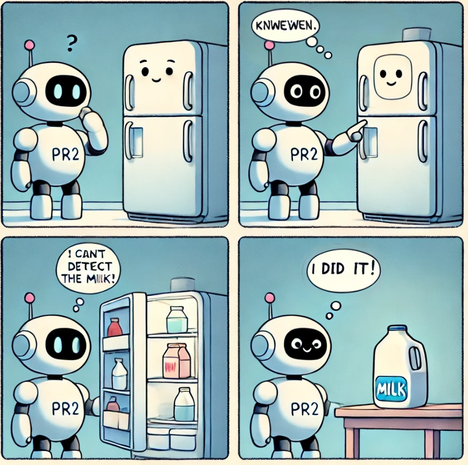

To understand the course, we will provide a brief overview of the entire course. 

  For Entering the Story click here:
  <a class="btn btn-success" target="_blank" href="chapter0/"><b>Story Mode Activate!</b></a>

<!--more-->

 <h1> Welcome to PR2's first Mission!</h1>

**The Story**:
Once upon a time, there was a robot named PR2, tasked with helping its human companions in their daily routines. 
PR2 was highly intelligent, able to perform complex tasks like cooking breakfast or tidying up the living room. 

**Problem**:
But one particular day, PR2 encountered a problem that made it question its understanding of the world around it.
It was a regular morning, and PR2's mission was simple: fetch the milk for breakfast. 
The milk, as always, was kept in the fridge. With its sensors and advanced object detection algorithms, 
PR2 was certain that it could locate the milk without any trouble. Confident in its abilities, 
the robot approached the kitchen and activated its detection systems, scanning the room for the familiar white carton.
But after several moments of scanning, PR2 grew puzzled. There was no milk in sight. 
The robot rechecked its belief database, confirming that the milk should be in the fridge. 
Yet, when it looked at the fridge from the outside, all it could perceive was the fridge door, 
standing silently in front of it. PR2 couldn’t see through the fridge, and no matter how advanced its sensors were, 
the milk remained hidden behind that solid barrier.
Then came a sudden realization. Of course! The fridge door was closed, 
and until it opened the door, the milk would remain out of reach, not just physically, but also perceptually.

**Understanding**:
PR2 had encountered a fundamental truth about the world that even the most advanced 
technology couldn’t escape: sometimes, things are hidden from view until the environment changes. 
The fridge door acted as a shield, blocking PR2's sensors from detecting the objects inside.
The realization was profound. PR2 understood that some actions are prerequisites for others.
The act of opening the fridge wasn’t just a step in retrieving the milk—it was necessary for perceiving the milk at all.
Without opening the fridge, PR2 couldn’t gather the data it needed to find the milk.
This taught PR2 an important lesson about tasks and perception. Just as humans understand intuitively that opening doors,
drawers, or cabinets reveals hidden objects, robots like PR2 needed to learn these causal relationships. 
The door was a barrier, and barriers needed to be removed before certain actions—like detecting the milk—could be performed.

**The Solution**:
PR2 opened the fridge door, and like magic, the milk appeared, perfectly placed on the middle shelf. 
With its sensors now able to detect the milk’s familiar shape and color, the robot completed its task.
From that day forward, PR2 never forgot that sometimes the world is more than just what it can see. 
To truly interact with its environment, it had to consider not only the objects it needed to manipulate, 
but the steps required to even perceive those objects in the first place.
And so, PR2 became a better robot, one that understood the subtle, yet vital, 
importance of knowing when to act before it could perceive. Because in a world full of hidden objects, perception wasn’t just about what was visible—it was about what could become visible, with the right actions.

   

The Quest
---

PR2's journey has just begun, and now it's your turn to guide it on its first mission! 
Your objective is clear: help PR2 successfully retrieve the milk from the fridge and place it on the table. 
But beware, this is no simple task—PR2 must first learn to open the fridge before it can even perceive the milk inside.
This isn't just about getting the milk; it's about mastering the subtle art of perception, action, and interaction with the world.

**Questline Steps:**
Step 1: Create the World

In order to help PR2, you’ll first need to build the environment it will navigate. Construct a URDF model with essential objects like a fridge, table, and some key items PR2 will interact with.

Step 2: Let the Robot perceive the Milk.
Understand how PR2 perceives the world around it. Program the robot to move to a specific location and use its sensors to detect the milk carton.

Step 3: Query the knowledgebase
Guide PR2 through its learning process. Before PR2 can see the milk, it needs to understand that the fridge door must be opened. Program this action as part of the task.

Step 4: Open the Fridge
Now that the fridge is open, PR2 can scan and detect the milk carton inside. Help it to successfully fetch the milk and place it on the table.

Step 5: The Final Task
yet to be determined

The Goal
---
By the end of Chapter 5, PR2 will be fully equipped to execute this task in a seamless manner in simulation.

Software Components
---

- ### [CRAM ](https://cram-system.org/)
  is a software toolbox for the implementation of autonomous robots.\
  [ source code](https://github.com/cram2/cram)
  
- ### [KnowRob ](https://www.knowrob.org/)
  is a knowledge processing system for robots.\
  [ source code](https://github.com/knowrob/knowrob)

- ### [OpenEASE ](http://www.open-ease.org/)
  is a web-based knowledge service providing robot and human activity data.\
  [ source code](https://github.com/ease-crc/openease)

- ### [GISKARD ](https://github.com/SemRoCo/giskardpy)
  is a framework for constraint- and optimization-based robot motion and planning control.\
  [ source code](https://github.com/SemRoCo/giskardpy)

- ### [ROBOKUDO ](https://robokudo.ai.uni-bremen.de/)
  is a perception framework targeted for robot manipulation tasks.\
  [ source code](https://gitlab.informatik.uni-bremen.de/robokudo/robokudo)

- ### [PyCRAM ](https://pycram.readthedocs.io/en/latest/index.html)
  is the Python 3 re-implementation of [CRAM](https://cram-system.org/). [PyCRAM](https://pycram.readthedocs.io/en/latest/index.html) is a toolbox for designing, implementing and deploying software on autonomous robots.\
  [ source code](https://github.com/cram2/pycram)

Courses and/or Turorial
---

- ### Courses:

  + ##### [Integrated Intelligent Systems](https://ai.uni-bremen.de/teaching/le-iis-ws23)
    This lecture covers contemporary techniques of AI in cognitive robotics.

  + ##### [Robot Programming with ROS](https://ai.uni-bremen.de/teaching/cs-ros-ws23)
    Getting into the Robot Operating System ROS is a steptone for future roboticists.

  + ##### [SUTURO - sudo tidy-up-my-room](https://ai.uni-bremen.de/teaching/pr-suturo-ws23)
    Students in this project design their own application to run on a real robot.

  

      
  

  

       <h3> Vanessa Hassouna</h3>
    Tel:  +49 421 218 99651  
    Mail:     <a href="mailto:hassouna@cs.uni-bremen.de">hassouna@cs.uni-bremen.de</a>  
      <a style="color:red" href="https://ai.uni-bremen.de/team/vanessa_hassouna">
      Profile Vanessa Hassouna
    </a>
  

