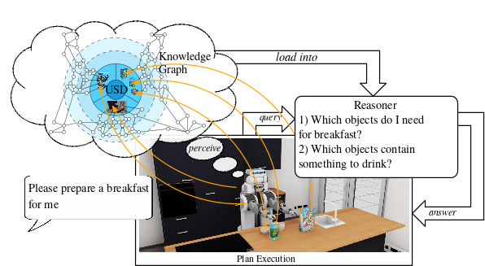
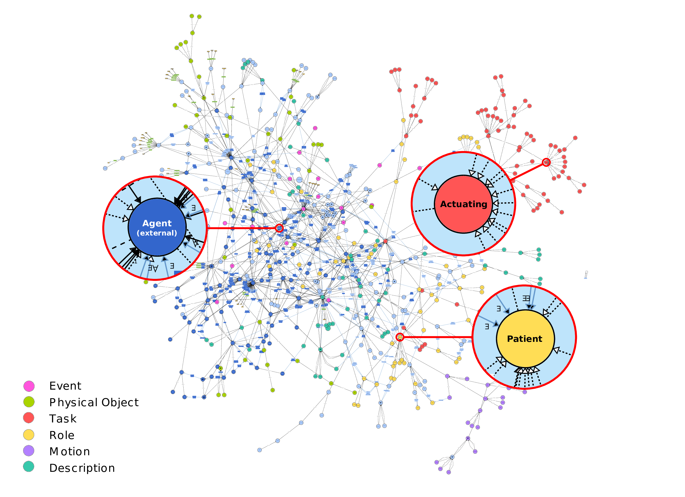
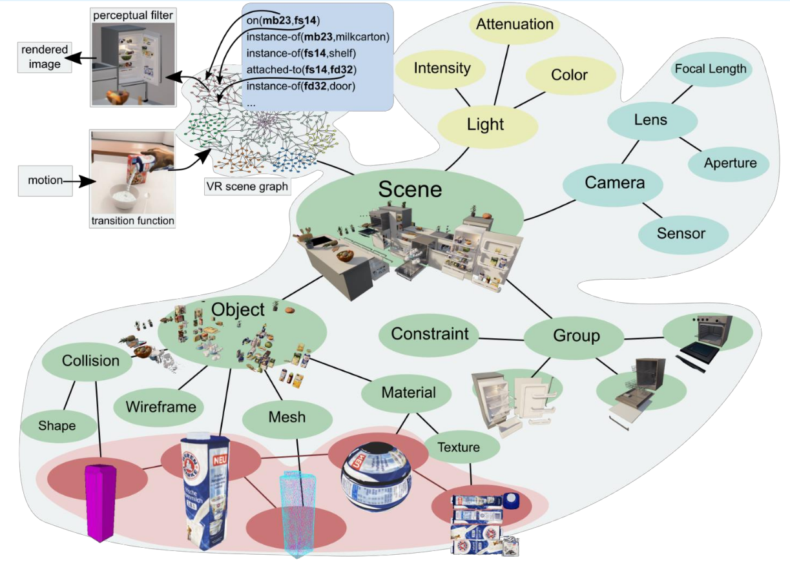
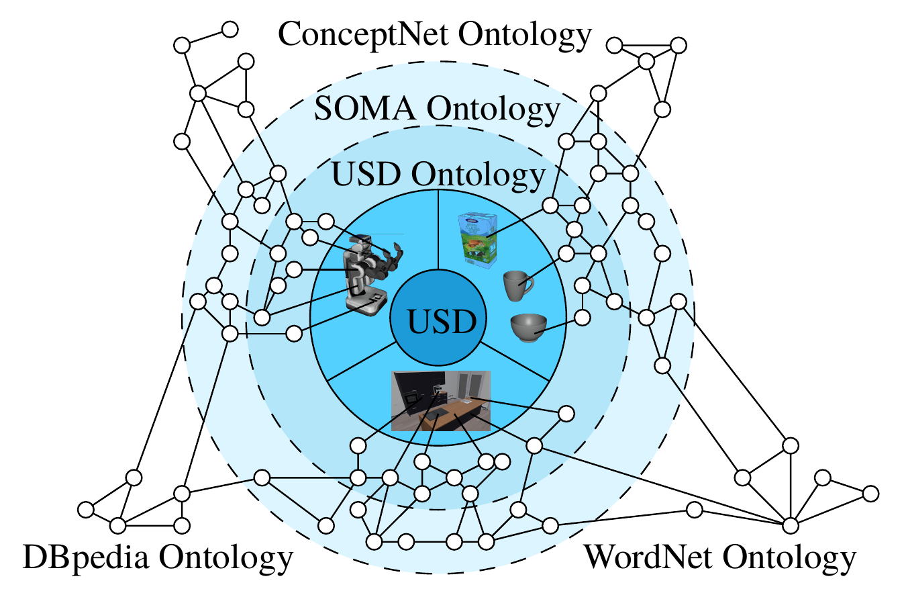
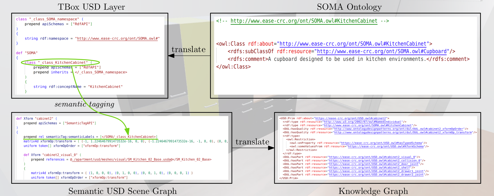

<div class="hidde-after-preview">
In Chapter 1, you will learn to create a simulation environment using the Unified Robot Description Format (URDF). 
You’ll set up a basic URDF model that includes essential objects like a fridge and a table, and visualize it. 
This foundational knowledge will enable you to understand how robots interact with their surroundings.

  For Entering Chapter one click here:
  <a class="btn btn-success" target="_blank" href="chapter1/"><b>Chapter 1!</b></a>
</div>


# Welcome to the First Chapter of Our Hands-On Course!


In dynamic robotic environments, scene graphs are a way to represent complex spatial relationships. They act as the backbone of a robot’s understanding, mapping “who is where” and “what connects to what” in complex, dynamic spaces. With scene graphs, robots can navigate, adapt, and interact intelligently, as you'll see in the video of our lab simulation. This technology is essential for enabling robots to perform tasks in real-world-like settings—think seamless object handling, precise navigation, and real-time adaptability. By additionally linking the scene graph to a semantic knowledge base, robots gain a higher level of contextual awareness, allowing them to reason about the environment, anticipate changes, and make informed decisions, bringing us closer than ever to fully autonomous, perceptive machines.

<figure class="video_container">
  <video width="100%%" height="300" autoplay loop muted controls>
    <source src="vid/ApartmentDemo.mp4" type="video/mp4">
    Your browser does not support the video tag.
  </video>
</figure>

In this chapter, you'll learn how to create a scene graph using URDF (Unified Robot Description Format). URDF is essential because it helps define the structure, shape, and physical properties of objects, allowing robots to interact with them accurately in a simulated environment. After creating the scene graph you will extend it with semantic information, creating a semantic digital twin.

---

# Part 1: Introduction to Scene Graphs in URDF

### **Goal**
By the end of this session, you will have worked with a simple URDF model that includes essential objects like a fridge, a table, and other items, and visualized this setup in RVIZ.

## Theoretical Background

### What is URDF?
URDF stands for Unified Robot Description Format. As the name suggests, it was originally designed for describing robots, specifically their physical structure and properties. A robot is an electromechanical device composed of multiple bodies (also called links) connected by joints. Each link represents a physical part of the robot, and joints define how these parts move relative to each other.

However, URDF is not limited to describing robots. In this course, we use it as a tool for defining and simulating an entire environment as a scene graph. This means we use URDF to model various elements in the environment, such as furniture, objects, and other items with which the robot will interact.

URDF helps create a virtual representation of an environment, as seen in the video above, by defining the structure, shape, and physical properties of the objects involved. This details are crucial for creating realistic interactions in simulations, enabling robots to understand their surroundings and perform tasks effectively.

### Links and Joints in URDF
A link in a URDF model represents a physical object in the environment, which could be as simple as a box or as complex as a piece of furniture. A link is defined by several parameters, including:
- **Visual Parameter**: Defines how the link appears in the simulation.
- **Collision Parameter**: Defines the simplified shape used to detect collisions, which is generally simpler than the visual parameter to reduce computational load.
- **Inertial Parameter**: Defines how the link behaves under physical forces, which is important for physics-based simulations like those in Gazebo.

<div style="flex:30%;">
  
</div>

Joints connect different links and define how they move relative to each other. In an environment model, joints can be used to define relationships such as doors on a fridge that can open or the legs of a table attached to its surface.

Now, let's see how two links can be connected. In environmental models, two types of joints are particularly useful for describing how parts of furniture or other items behave. Revolute joints can perform a rotary motion, like a door hinge that allows a fridge door to swing open. Prismatic joints, on the other hand, can perform a linear motion, such as a drawer sliding in and out of a cabinet. These two types of joints are fundamental in modeling dynamic objects in the environment, helping simulate realistic interactions that robots may need to handle effectively. The two following images show examples of prismatic and revolute joints.

<div style="flex:30%;">
  
</div>

A joint in URDF defines how two links are connected and how they move relative to each other. Each joint requires specific parameters to describe its properties, such as the type of joint (e.g., revolute or prismatic), the axis of movement, and the parent and child links it connects. Additionally, limits can be defined for revolute and prismatic joints to specify the range of motion. The following image will illustrate an example of how a joint is defined in URDF for a robot arm.

<div style="flex:30%;">
  
</div>

## Hands-On Exercise 1

### Step-by-Step Hands-On Exercises
1. **Load a Basic URDF File Structure and visualize it**
2. **Add and modifiy Objects in the Scene Graph**: Integrate models for the fridge, table, and other essential items into your URDF.

### Summary
By the end of the session, you will have a working URDF environment, and you will understand the process of creating and visualizing a scene graph in URDF.

Throughout the exercises, we will provide code examples to demonstrate how to define links, joints, and meshes effectively.

To run the interactive Hands-On Tutorial follow please click this button:

<a class="btn btn-success" target="_blank" href="https://binder.intel4coro.de/v2/gh/IntEL4CoRo/ease_fall_school_2024/main?urlpath=lab%2Ftree%2Fday1%2FURDF.ipynb">URDF Hands-On Lab</a>

## Further Reading/Exercises

For those interested in exploring more, we’ll provide links to additional ROS URDF tutorials and Gazebo documentation.

- A in-depth tutorial for URDF can be found <a href="https://wiki.ros.org/ROS/Tutorials">here</a>
- **Challenge**: Try adding a new object, like a cup, to your environment and adjust its position to fit the scene. This will help reinforce your understanding of how to modify URDF files.

---

# Part 2: Scene Graphs and Knowledge Representation: Semantic Digital Twins

### **Goal**
By the end of this session, you will understand how to extend the scene graph concept to represent knowledge in a semantic digital twin, allowing for richer interaction between the robot and its environment.

## Theoretical Background

### What is Knowledge Representation for Robotics and Why is it Important?

Knowledge representation in robotics is a way to organize information so that robots can reason about the world around them. It involves encoding the relationships between objects, actions, and properties, allowing robots to interpret and interact with their environment intelligently. Knowledge representation is important because it enables robots to make informed decisions, understand complex instructions, and adapt to dynamic environments, which is especially crucial for autonomous and cognitive robotic tasks. The diagram below shows how a knowledge processing system could look like. The scene graph is connected to the knowledge graph, which is then used by reasoner to answer questions like "Which objects do I need for breakfast?" or "Which objects contain something to drink?"

<div style="flex:30%;">
  
</div>

Knowledge graphs and ontologies are a fundamental tool in knowledge representation, particularly useful for organizing and connecting information about objects, actions, and their relationships in a meaningful way. Ontologies define the core concepts, relationships, and rules in a domain—like what “Grasping” means and the requirements for it. Knowledge graphs, built on these ontologies, hold specific instances and connections, such as a particular milk carton on a table. This structure allows robots to answer targeted questions, like "What objects do I need for breakfast?". By combining both, robots gain a flexible framework for reasoning, integrating broad concepts with real-time, specific data. <!-- Resource Description Framework (RDF) and Web Ontology Language (OWL) are two key technologies used in this context. RDF provides a standard way to represent data in the form of subject-predicate-object triples, allowing robots to understand facts about their environment. OWL, on the other hand, is used to define complex relationships between entities and establish richer semantics, enabling robots to perform more sophisticated reasoning. Together, RDF and OWL provide a powerful foundation for building knowledge graphs that enhance the cognitive abilities of robots. -->

SOMA (Socio-physical Model of Activities) is an example of a robot ontology that integrates both the physical and social aspects of activities to enhance the reasoning capabilities of robotic agents. It enables autonomous robots to interpret and execute everyday tasks by connecting physical actions with socially constructed knowledge. By representing the roles that objects can play, SOMA allows robots to reason about object affordances and activities in a flexible manner. This ontological approach provides a structured framework that helps robots deal with underspecified tasks, similar to how humans use context and experience to fill in gaps, thereby enabling robots to plan and adapt actions effectively to achieve their goals.

<div style="flex:30%;">
  
</div>

### What is a Semantic Digital Twin and Why is it Important?

A semantic digital twin is an enriched digital representation of a real-world entity that includes not just physical details, but also semantic information about the relationships, roles, and functions of objects. In robotics, a semantic digital twin allows a robot to understand both the physical properties of objects (e.g., shape and material) and their intended use or role in tasks. This semantic layer is crucial for enabling robots to perform complex tasks involving interactions with multiple objects and adapting to changing environments. By incorporating semantic knowledge, robots can reason more effectively about how to complete a task, making them more capable of handling unpredictable scenarios.

<div style="flex:30%;">
  
</div>

## Hands-On Exercise 2

### Step-by-Step Hands-On Exercises
1. **Query the Knowledge Base**: Query the Knowledge Base in our: 
<a class="btn btn-success" target="_blank" href="https://binder.intel4coro.de/v2/gh/sasjonge/semantic-map-lab.git/dfl_reasoner?labpath=notebooks%2Fsemantic_map.ipynb">KnowRob Lab</a>


## Extended Material for Scene Description (Optional)


### What is USD and How Do We Use it to Create a Knowledge Graph?
[Universal Scene Description (USD)](https://openusd.org/release/index.html) is a powerful format for representing complex scenes and environments in 3D. In robotics, USD can be used to create a unified scene graph that integrates data from different sources like URDF, MJCF, and SDF. This standardization into USD makes it easier to enrich the scene with semantic information. Using USD, we can create a semantic map by linking scene graph nodes to concepts in a robot ontology, such as SOMA or KnowRob, effectively transforming a scene graph into a knowledge graph.

<div style="flex:30%;">
  
</div>


The USD file format stores 3D scenes as hierarchical scene graphs (or *stages*). A stage is composed of different components such as *prims*, *layers*, *metadata* and *schemas*. So called *composition arcs* further allow for efficient data sharing and reuse between different parts of a scene.	USD also includes a powerful animation system that can be used to store and manage complex animations within a scene.	In USD, data is arranged hierarchically into namespaces of *prims* (primitives). Each prim can hold child prims, as well as *attributes* and *relationships*, referred to as *properties*. Attributes have typed values that can change over time, while relationships are pointers to other objects in the hierarchy, with USD automatically remapping the targets when namespaces change due to referencing. In addition, both prims and properties can have non-time-varying metadata. All of these elements, including prims and their contents, are stored in a *layer*, which is a scene description container for USD. This hierarchical structure allows for easy organization of the scene, and enables transformations and properties to be inherited from parent prims to their children. This example shows how a cardboard box with two flaps can be represented using a hierarchy of prims in USD.

```usd
def Xform "world" () {
  def Xform "box" (
      prepend apiSchemas = ["PhysicsMassAPI", ...]
  ) {
    matrix4d xformOp:transform = ( ... )
    token[] xformOpOrder = ["xformOp:transform"]
    point3f physics:centerOfMass = ( ... )
    float physics:mass = 2.79

    def Cube "geom_1" ( ... ) { ... }

    def PhysicsRevoluteJoint "box_flap_1_joint" {
      rel physics:body0 = </world/box>
      rel physics:body1 = </world/box_flap_1>
    }

    def PhysicsRevoluteJoint "box_flap_2_joint" { 
      rel physics:body0 = </world/box>
      rel physics:body1 = </world/box_flap_2>
    }
  }

  def Xform "box_flap_1" ( ... ) { ... }

  def Xform "box_flap_2" ( ... ) { ... }
}
```

The translation of a USD scene into a knowledge graph involves three steps. The first step is to establish a USD layer containing class prims representing the TBox ontology. Another layer representing
the scene graph imports the TBox USD layer and uses a custom API to tag prims with ontological concepts. The semantic USD scene graph are then translated into the KG.

<div style="flex:30%;">
  
</div>

## Playground
To get further information on how **USD's** are processed play around in our: 
<a class="btn btn-success" target="_blank" href="https://binder.intel4coro.de/v2/gh/Multiverse-Framework/Multiverse-Docker/main?urlpath=lab%2Ftree%2FMultiverse-Tutorials%2Ftutorials%2Fmultiverse_knowledge.ipynb">Multiverse Knowledge Lab</a>


## Further Reading/Exercises

Explore the concept of Semantic Digital Twins in more detail through provided research papers and tutorials.

- A more in-depth tutorial for OWL and RDF can be found [here](https://cambridgesemantics.com/blog/semantic-university/learn-owl-rdfs/owl-101/)
- Publication for the USD scenes translation into knowledge graphs:
  - [Giang Nguyen, Daniel Beßler, Simon Stelter, Mihai Pormalan and Michael Beetz, "Translating universal scene descriptions into knowledge graphs for robotic environment." 2024 IEEE International Conference on Robotics and Automation (ICRA). IEEE, 2024.](https://ieeexplore.ieee.org/iel8/10609961/10609862/10611691.pdf)

- Publication for the SOMA ontology:
  - [Daniel Beßler, Robert Porzel, Mihai Pomarlan, Abhijit Vyas, Sebastian Höffner, Michael Beetz, Rainer Malaka and John Bateman, "Foundations of the Socio-physical Model of Activities (SOMA) for Autonomous Robotic Agents", In Formal Ontology in Information Systems - Proceedings of the 12th International Conference, FOIS 2021, Bozen-Bolzano, Italy, September 13-16, 2021, IOS Press, 2021, doi:10.3233/FAIA210379](https://ai.uni-bremen.de/papers/bessler21soma.pdf)
- KnowRob, as a reasoning engine for Knowledge Graphs:
  - [Github](https://github.com/knowrob/knowrob)
  - [KnowRob 2.0 – A 2nd Generation Knowledge Processing Framework for Cognition-enabled Robotic Agents (Michael Beetz, Daniel Beßler, Andrei Haidu, Mihai Pomarlan, Asil Kaan Bozcuoglu and Georg Bartels), In International Conference on Robotics and Automation (ICRA), 2018](https://ai.uni-bremen.de/papers/beetz18knowrob.pdf)
- openEASE Knowledge Service Laboratory, can be found [here](http://localhost:1313/page/labs/openease-knowledge-service-laboratory/)
- **Challenge**: Try creating an OWL from your own environment and find interesting queries!


<div class="main-well-flex-container" style="margin:20px;align-items: center;">

  <div style="flex:30%;">
      
  </div>

  <div style="flex:70%;">
       <h3> Sascha Jongebloed</h3>
    Mail:     <a href="mailto:jongebloed@uni-bremen.de">jongebloed@cs.uni-bremen.de</a> <br>
      <a style="color:red" href="https://ai.uni-bremen.de/team/sascha_jongebloed">
      <span style="font-size: 15px;">Profile Sascha Jongebloed</span>
    </a>
  </div>
</div>
<div class="main-well-flex-container" style="margin:20px;align-items: center;">

  <div style="flex:30%;">
      
  </div>

  <div style="flex:70%;">
       <h3> Yanxiang Zhan</h3>
    Mail:     <a href="mailto:yanxiang@uni-bremen.de">yanxiang@uni-bremen.de</a> <br>
      <a style="color:red" href="https://ai.uni-bremen.de/team/yanxiang_zhan">
      <span style="font-size: 15px;">Profile Yanxiang Zhan</span>
    </a>
  </div>
</div>
<div class="main-well-flex-container" style="margin:20px;align-items: center;">

  <div style="flex:30%;">
      
  </div>

  <div style="flex:70%;">
       <h3>Giang Nguyen</h3>
    Mail:     <a href="mailto:hoanggia@cs.uni-bremen.de">hoanggia@cs.uni-bremen.de</a> <br>
      <a style="color:red" href="https://ai.uni-bremen.de/team/giang_nguyen">
      <span style="font-size: 15px;">Profile Giang Nguyen</span>
    </a>
  </div>
</div>


<div class="main-well-flex-container" style="margin:20px;align-items: center;">

  <div style="flex:30%;">
      
  </div>

  <div style="flex:70%;">
       <h3> Vanessa Hassouna</h3>
    Tel:  +49 421 218 99651 <br>
    Mail:     <a href="mailto:hassouna@cs.uni-bremen.de">hassouna@cs.uni-bremen.de</a> <br>
      <a style="color:red" href="https://ai.uni-bremen.de/team/vanessa_hassouna">
      <span style="font-size: 15px;">Profile Vanessa Hassouna</span>
    </a>
  </div>
</div>

