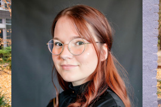

On Chapter 2, you'll focus on basic robot movements and perception.
You'll learn to move the robot to a table and use its sensors to detect a milk carton.
Understanding the challenges in perception, such as occlusions, will enhance your knowledge of how robots gather information from their environment.

For Entering Chapter two click here:
<a class="btn btn-success" target="_blank" href="chapter2/"><b>Chapter 2!</b></a>

<!--more-->

<h1> Welcome to the second day of our hands-on course!</h1>
Today, you'll dive into the basics of robot movement and perception. You will learn how to navigate the robot to a designated location (like a table) and utilize sensors to detect objects, specifically focusing on a milk carton.

**Goal**: By the end of the session, you will successfully move the robot to a table and implement perception algorithms to identify a milk carton.

## Prerequisites
- Finished Chapter 1 and have a basic understanding of URDF.
- Basic understanding of computer vision and OpenCV is beneficial for the perception part of this tutorial, but not required.

## Theoretical Background
- We'll cover the basics of robot movement planning and perception systems.
- You'll learn about common issues in perception, such as occlusions and the importance of having a clear line of sight for successful detection.

#### PyCram Framework
PyCRAM is the Python 3 re-implementation of CRAM. PyCRAM is a toolbox for designing, implementing and deploying software on autonomous robots. 
The framework provides various tools and libraries for aiding in robot software development as well as geometric reasoning and fast simulation mechanisms 
to develop cognition-enabled control programs that achieve high levels of robot autonomy.  PyCRAM is developed in Python with support 
for the ROS middleware which is used for communication with different software components as well as the robot.

PyCRAM allows the execution of the same high-level plan on different robot platforms. Below you can see an example of this where the plan is executed on the PR2 and the IAIs Boxy.

  
  

For more information on PyCRAM, please visit the [PyCRAM Documentation](https://pycram.readthedocs.io/en/latest/) 
and Github repository [here](https://github.com/cram2/pycram).

#### Designators

Designators are our  way of representing actions, motions, objects and locations.

Specifically in PyCRAM, Designators consist of a description and a specified element. 
Descriptions describe sets of designators and designators are one thing in the described set. 
For example, such a description could describe an action where the robot moves to a location from where it can grasp an object. 
The specific location in this case is not relevant as long as the robot can reach the object.
The designator description will be resolved during runtime which results in a designator with specific parameter, 
the resulting designator can also be performed to let the robot perform the desired behaviour.

You will learn more about that in the following exercises.

## Step-by-Step Hands-On Exercises
1. **Move the Robot**: Program the robot to navigate to a predefined location near the table.
2. **Object Detection**: Use a camera sensor to detect and identify the milk carton.
3. **Understand Object Designators**: Learn how to use designators to represent objects.
4. **Perception Tasks**: Learn how our perception executive framework can be adapted to different perception tasks.

Throughout these exercises, we will provide code examples to help you move the robot and utilize computer vision techniques effectively.

Interactive Actions and/or Examples
---
For Hands-On Exercise 1-3, please use the following Virtual Lab first: <a class="btn btn-success" target="_blank" href="https://binder.intel4coro.de/v2/gh/sunava/pycram/4cca5213134e23f1efa66fbfd46f5649accc1af8?urlpath=lab%2Ftree%2Fdemos%2Fpycram_fallschool_2024%2F02_robot_simulation_perception.ipynb
">Robot Simulation Perception</a>

For Hands-On Exercise 4, please use this Virtual Lab: 
<a class="btn btn-success" target="_blank" href="https://binder.intel4coro.de/v2/git/https%3A%2F%2Fgitlab.informatik.uni-bremen.de%2Ffmuehlis%2Frobokudo-lab.git/tutorials?urlpath=lab%2Ftree%2Frobokudo.jupyterlab-workspace">RoboKudo Getting Started Lab</a>

## Summary
By the end of the session, you'll have a clearer understanding of basic motion planning and the challenges associated with perception in robotics.

## Further Reading/Exercises
- For those interested in the interface between PyCram and RoboKudo, check out the [PyCram Documentation](https://pycram.readthedocs.io/en/latest/notebooks/interface_examples/robokudo.html).
- RoboKudo is built upon behavior trees. If you want to read more about the general concept of behavior trees, there is an excellent, comprehensive book on [arxiv](arxiv.org) which can be seen [here](https://arxiv.org/abs/1709.00084).
- For sensor data processing, Robokudo makes heavy use of [OpenCV](https://www.opencv.org) and [Open3D](https://www.open3d.org).
- **Challenge**: Experiment with different sensor configurations to improve the accuracy of the object detection process.

Related Videos
---
Cram Overview:
<figure class="video_container">
  <iframe width="100%" height="360" src="https://www.youtube.com/embed/pv_n9FQRoZQ?si=j3CB2Sj4itd_1qlC" title="YouTube video player" frameborder="0" allow="accelerometer; autoplay; clipboard-write; encrypted-media; gyroscope; picture-in-picture; web-share" allowfullscreen="true"></iframe>
</figure>

RoboKudo Overview: 
<figure class="video_container">
  <iframe width="100%" height="360" src="https://www.youtube-nocookie.com/embed/8jvDl-P2ba0?si=AGOn8iCWjDShdMeJ" title="YouTube video player" frameborder="0" allow="accelerometer; autoplay; clipboard-write; encrypted-media; gyroscope; picture-in-picture; web-share" allowfullscreen="true"></iframe>
</figure>

  

      
  

  

       <h3> Vanessa Hassouna</h3>
    Tel:  +49 421 218 99651  
    Mail:     <a href="mailto:hassouna@cs.uni-bremen.de">hassouna@cs.uni-bremen.de</a>  
      <a style="color:red" href="https://ai.uni-bremen.de/team/vanessa_hassouna">
      Profile Vanessa Hassouna
    </a>
  

  

      
  

  

    <h3> Patrick Mania</h3>
    Tel:  +49 421 218 64004  
    Mail: <a href="mailto:pmania@cs.uni-bremen.de">pmania@cs.uni-bremen.de</a>  
    <a style="color:red" href="https://ai.uni-bremen.de/team/patrick_mania">
        Profile Patrick Mania
    </a>

  

      
  

  

    <h3> Jonas Dech</h3>
    Tel: +49 421 218 64024  
    Mail: <a href="mailto:jdech@uni-bremen.de">jdech@uni-bremen.de</a>  
    <a style="color:red" href="https://ai.uni-bremen.de/team/jonas_dech">
        Profile Jonas Dech
    </a>
  

  

      
  

  

    <h3> Max Gandyra </h3>
    Mail: <a href="mailto:gandyra@uni-bremen.de">gandyra@uni-bremen.de</a>  
    <a style="color:red" href="https://ai.uni-bremen.de/team/max_gandyra">
        Profile Max Gandyra
    </a>
  

  

      
  

  

       <h3> Prof. Michael Beetz PhD</h3>
    Tel:  +49 421 218 64001  
    Mail:     <a href="mailto:beetz@cs.uni-bremen.de">beetz@cs.uni-bremen.de</a>  
      <a style="color:red" href="https://ai.uni-bremen.de/team/michael_beetz">
      Profile Michael Beetz
    </a>
  

