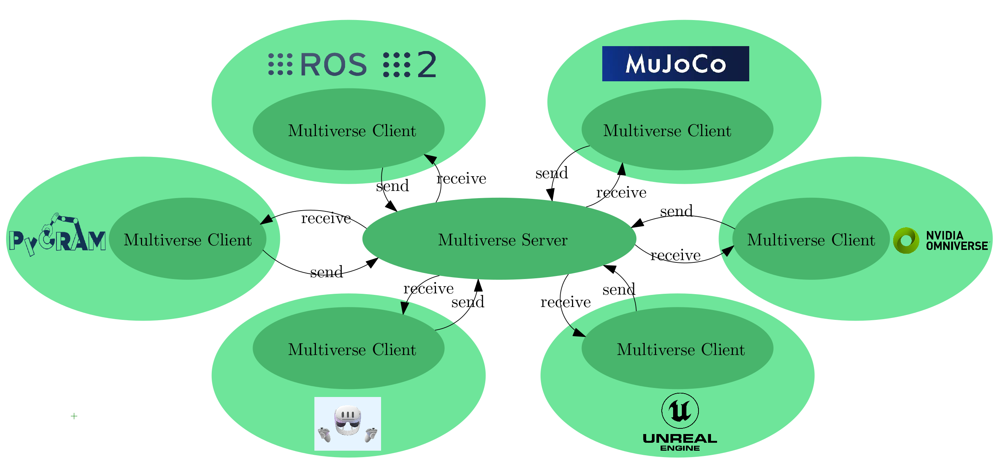

On Chapter 4, you will integrate all components learned in the previous sessions to complete the milk delivery task.
You will plan and execute the full sequence of actions from opening the fridge to placing the milk on the table.

For Entering Chapter four click here:
<a class="btn btn-success" target="_blank" href="chapter4/"><b>Chapter 4!</b></a>

<!--more-->

  

      
  

 

<h1> Welcome to the fourth day of our hands-on course!</h1>
Today, you will focus on executing the complete task of transporting milk from the fridge to the table. This session will integrate all the knowledge and skills you've developed so far.

**Goal**: By the end of the session, you will have successfully completed the full milk delivery task, demonstrating how to combine perception, planning, and knowledge retrieval.

## Prerequisites
- Ensure you have completed Chapters 1-3 and have a solid understanding of URDF, perception, and planning.

## Theoretical Background
- We will recap all components involved in the task: URDF, perception, planning, and knowledge base utilization.
- You will learn about common simulation gaps and limitations that may arise during task execution.
- Discover the concept of Multiverse and how various physical simulations can address distinct challenges.
#### Bullet World
The Bullet World in PyCRAM serves as a simulation environment based on the Bullet physics engine, allowing for detailed robotic task simulation. Here’s a breakdown to include in your tutorial:

**What is Bullet World?**
Bullet World is a physics-based simulation space within PyCRAM, which provides essential physics support for simulating robots, objects, and interactions. 
It uses the Bullet physics engine to simulate aspects like collision detection, rigid body dynamics, and constraints, all of which are crucial for realistic robotic task planning and execution.

**Key Features of Bullet World**
- **Object Handling**: Bullet World lets you spawn, move, and interact with objects in a 3D simulated space. 
Robots and objects are imported using URDF (Unified Robot Description Format) files, enabling detailed representations of their structure and properties.

- **Collision Detection**: The environment includes built-in collision detection, allowing the robot to interact naturally 
with objects and other entities in the world. This feature is essential for tasks involving manipulation, grasping, and placing objects.

- **Environment Control**: Bullet World provides commands to control the environment, like resetting positions, 
adding or removing objects, and stepping through the simulation. This control is useful for creating specific scenarios or repeating tasks for testing.
#### Multiverse

[Multiverse](multiverseframework.readthedocs.io) is a simulation framework designed to integrate multiple advanced physics engines such as MuJoCo, Project Chrono, and SOFA along with various photo-realistic graphics engines like Unreal Engine and Omniverse. Additionally, Multiverse provides the capability to generate knowledge graphs dynamically during runtime.

  

A distinctive feature of Multiverse is its capability to integrate various physics and graphics engines and operate them simultaneously. This capability is grounded in a star architecture, with the server at the core, coordinating data sharing among different client simulators.

In this framework, “simulator” encompasses a broad range of entities, including not only physics engines and graphics engines but also VR headsets that interpret objects geometry, position, and orientation to render them, and controllers that compute forces and torques based on physics data. It can also include Python scripts to manipulate and analyze this data. The possibilities are endless, making it adaptable to many different scenarios. The Multiverse Server-Client is the essential foundation that makes this versatility possible.

### Pycram-Multiverse integration

To enable Pycram to execute complex plans, it leverages multiple simulations tailored to different tasks. At its core, Pycram’s Bullet World supports physics simulation of rigid and soft bodies only. In complex scenarios, like object cutting or human-robot interaction in VR, a single simulation proves insufficient due to limited features. Adding more simulations can lead to code complexity and duplication. Multiverse addresses this issue by providing a unified API that abstracts the simulation environment, allowing seamless switching between simulators, such as Isaac Sim and MuJoCo, without altering the API. Moreover, users can easily connect different simulators and software across various platforms, such as ROS1 on Ubuntu 20.04, ROS2 on Ubuntu 24.04, and VR on Windows 10/11. The TCP-based connection enables real-time simulation.

## Step-by-Step Hands-On Exercises
1. **Create a Task Plan**: Develop a comprehensive plan that incorporates all previous learnings.
2. **Simulate the Full Task**: Execute the task by opening the fridge, perceiving the milk, picking it up, and placing it on the table.

Interactive Actions and/or Examples
---

For Hands-On Exercises please use the following Virtual Lab: <a class="btn btn-success" target="_blank" href="https://binder.intel4coro.de/v2/gh/sunava/pycram/1a68c62696a07e1c288613cee303364f47041461?urlpath=lab%2Ftree%2Fdemos%2Fpycram_fallschool_2024%2F04_full_robot_simulation.ipynb
">Plan Executive</a>

## Summary
By the end of this session, you will have a clear understanding of how to integrate various components to achieve complex robotic tasks.

## Further Reading/Exercises
- Explore alternative strategies for task execution, including different object placements and adjustments to the environment.
- Discuss the differences between real-world gaps versus simulation limitations and how to manage them effectively.

Multiverse Application:
---
Box Opening and Object Storage Reasoning:
<figure class="video_container">
  <video width="100%%" height="300" autoplay loop muted controls>
    <source src="img/268483153-e2509d42-39ad-4fa1-8224-2bcc55ef098f.mp4" type="video/mp4">
    Your browser does not support the video tag.
  </video>
</figure>

Human-Robot Interaction in VR:
<figure class="video_container">
  <video width="100%%" height="300" autoplay loop muted controls>
    <source src="img/Pr2DemoX2.mp4" type="video/mp4">
    Your browser does not support the video tag.
  </video>
</figure>

Isaac Sim Integration with ROS1
<figure class="video_container">
  <video width="100%%" height="300" autoplay loop muted controls>
    <source src="img/IsaacSimShort.mp4" type="video/mp4">
    Your browser does not support the video tag.
  </video>
</figure>

  

      
  

  

       <h3> Vanessa Hassouna</h3>
    Tel:  +49 421 218 99651  
    Mail:     <a href="mailto:hassouna@cs.uni-bremen.de">hassouna@cs.uni-bremen.de</a>  
      <a style="color:red" href="https://ai.uni-bremen.de/team/vanessa_hassouna">
      Profile Vanessa Hassouna
    </a>
  

  

      
  

  

   <h3>Abdelrhman Bassiouny</h3>
   Room: TAB 2.88  
   Mail: <a href="mailto:bassioun@uni-bremen.de">bassioun(at)uni-bremen[dot]de</a>  
   <a style="color:red" href="https://ai.uni-bremen.de/team/abdelrhman_bassiouny">
      Profile Abdelrhman Bassiouny
   </a>

  

      
  

  

       <h3>Giang Nguyen</h3>
    Mail:     <a href="mailto:hoanggia@cs.uni-bremen.de">hoanggia@cs.uni-bremen.de</a>  
      <a style="color:red" href="https://ai.uni-bremen.de/team/giang_nguyen">
      Profile Giang Nguyen
    </a>
  

  

      
  

  

       <h3> Prof. Michael Beetz PhD</h3>
    Tel:  +49 421 218 64001  
    Mail:     <a href="mailto:beetz@cs.uni-bremen.de">beetz@cs.uni-bremen.de</a>  
      <a style="color:red" href="https://ai.uni-bremen.de/team/michael_beetz">
      Profile Michael Beetz
    </a>
  

