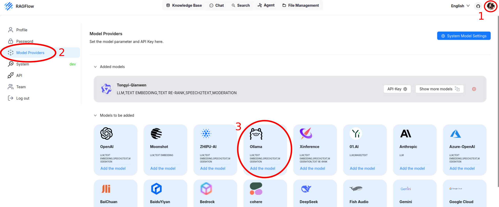
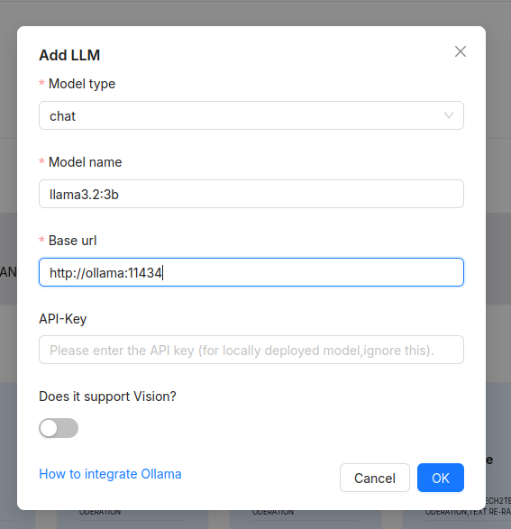
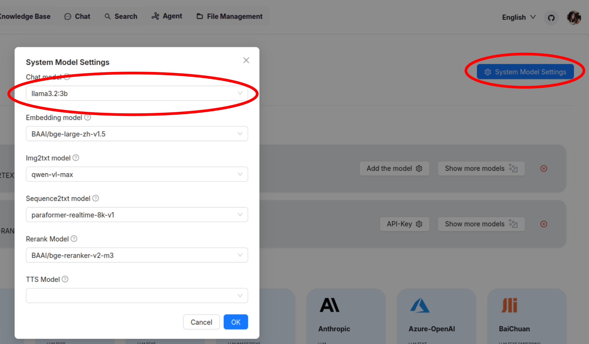
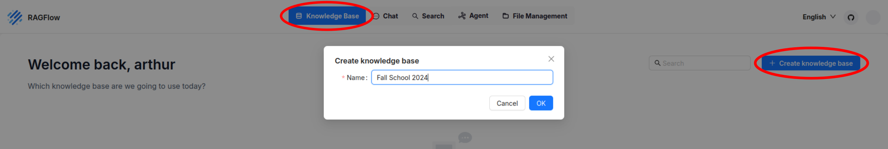
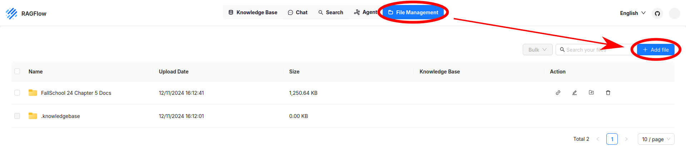
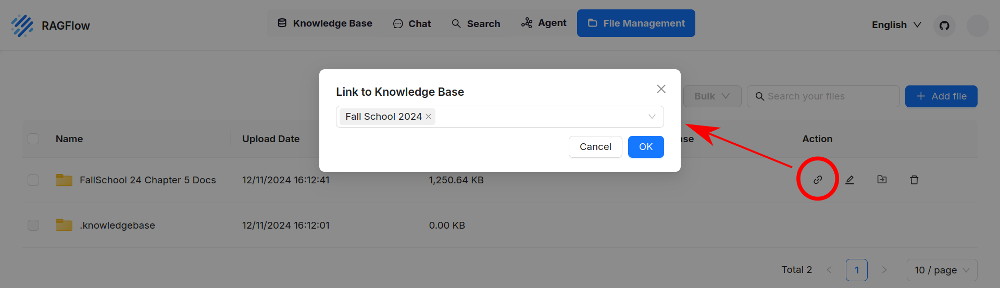
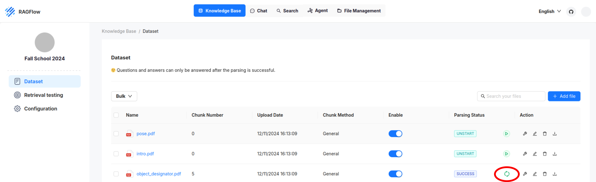
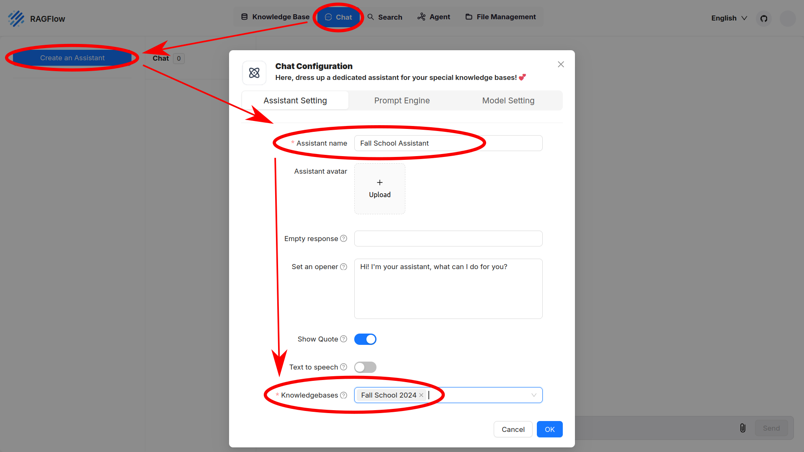
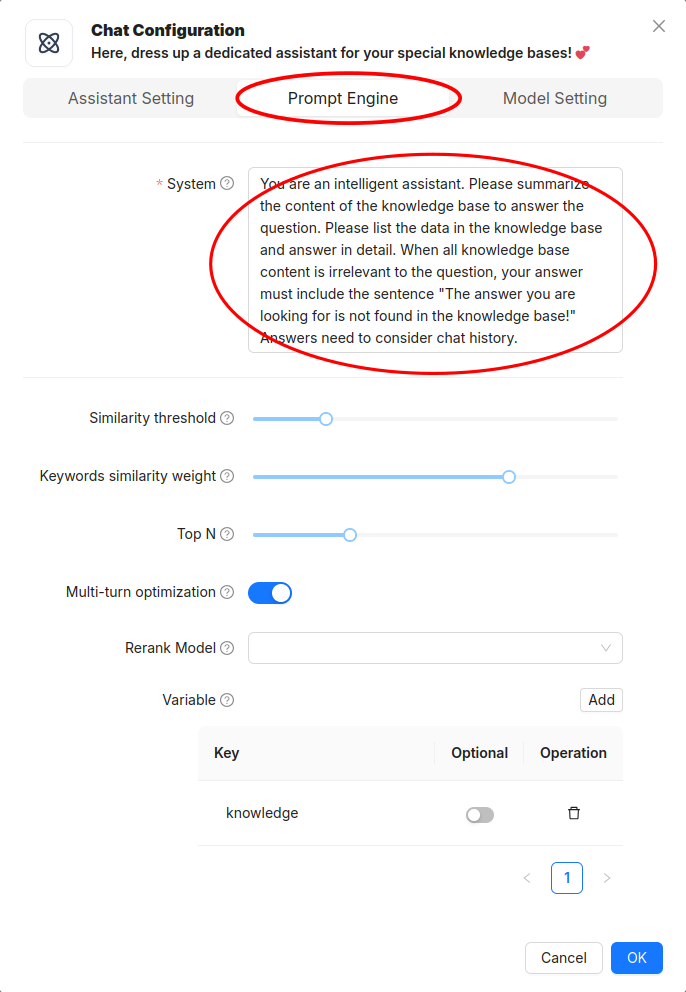

<div class="hidde-after-preview">
In Chapter 5, you will head into generative Large Language Models (LLMs) and how to fine-tune them. With Retrieval Augmented Generation (RAG) you create a specialized assistant that serves as a companion for robot programming.

For Entering Chapter five click here:
<a class="btn btn-success" target="_blank" href="chapter5/"><b>Chapter 5!</b></a>
</div>

<!--more-->

<h1> Welcome to the fifth day of our hands-on course!</h1>
Today, you will head into generative Large Language Models (LLMs) and how to fine-tune them. With Retrieval Augmented Generation (RAG) you create a specialized assistant that serves as a companion for robot programming. The software used is completely open-source and can be installed on your personal machines. For this course we offer the web service <a href="https://ragflow.io/">RAGflow</a>, utilizing models from OLLaMA to digest and extend its knowledge.

**Goal**: By the end of this session, you will know how to fine-tune an existing LLM with a knowledge base in the fashion of RAG, and define the assistants behavior through (initial) prompt-engineering.

## Prerequisites
- Participation in any of the previous hands-on lectures
- Download <a href="https://nc.uni-bremen.de/index.php/s/W86jfpykMRAwaWp">documentation files in TXT or PDF</a>

## Survey: Prior experience

How experienced would you consider yourself with AI assistants? Please enter in the following survey: https://particify.zmml.de/p/73823831

## Theoretical Background

In this lecture we use the Large Language Model **LLaMA3.2**, an openly available and pre-trained model by Meta, designed to be extended for research purposes. We prime the model with **initial instructions** and extend its knowledge with **Retrieval Augmented Generation**.

**Large Language Models** (LLMs) have been trained on the vast array of text available on the internet, and optimized to generate natural language in various styles and formats. There are multiple ways to change the behavior a model. Improvements are done by specializing a base model for a specific domain, its task, and how it should act. Example foundational models are GPT, BERT, T5, DALL-E and LLaMA. This chapter uses LLaMA.

**Training** requires a lot of example data as request and response. Most available models are already pre-trained for a specific purpose and ready to use.

**Fine-Tuning** is the general act of adding more knowledge to an existing LLM and specializing its purpose. Pre-trained LLMs are available in masses, but they are trained to respond with general knowledge about a broad field. To fine-tune a model, a relatively small but crucial set of knowledge is added to the model. Similarly, to make an LLM suitable as a tool for a specific task, its focus needs to be set straight. In this chapter, fine-tuning is achieved by giving an LLM the teaching-material for online courses on how to work with the PyCRAM architecture, authored by the architects.

**Initial instructions** specify how the assistant is meant to behave. Here are a few points that prime an assistant:

1. Define the Purpose and Scope
2. Specify Tone and Style
3. Provide Example Prompts and Responses
4. Incorporate Ethical and Safety Guidelines
5. Highlight Desired Behavior and Limitation
6. Set Specific Formatting or Structure Requirements
7. Include Feedback Mechanisms

Examples are given later, when defining the initial instructions for your assistant.

**Prompt engineering** is the ongoing extension of the initial instructions: request (prompt), response and refinement, such that the answer eventually contains the most desirable content, scope and depth of information. This can reach from the answers length, writing style, to strict data structures in program code or JSON-objects. The more precise the request, the better the answer. To refine the answer, keep the context of the conversation, refer back to the LLMs answer, so to specify in what way the current answer is unsatisfying, and provide constraints on how to improve the answer. With few-shot examples the prompts can be given more context, which again makes the answer more specific, therefore, make the request more specific regarding what the LLM should focus on in its response by giving it the knowledge required.

**Retrieval-Augmented Generation (RAG)** is a way to extend the knowledge of the LLM by giving it structured knowledge about the domain, in our case: the hands-on material for this Fall School. This specializes the LLM
to its specific use-case, defining what kind of tool the LLM is used as. For example, when the LLM is provided with program code and explanatory documentation, it can answer just like a teacher, explaining the program and refine their answer on demand. 

---

## Set up your RAGFlow

Go to http://ibis.informatik.uni-bremen.de and `sign up`.


### Link the Ollama chat model

1. Go to your `profile` in the top-right corner
2. From the list on the left select `Model Providers`
3. Select `Ollama` to add the model



4. In the pop-up, enter the following fields:
* Model type: `chat`
* Model name: `llama3.2:3b`
* Base url: `http://ollama:11434`



Hit OK. There should now be Ollama showing in the list.

### Set model defaults

Open the `System Model Settings` in the top-right.

Set the Chat model to `llama3.2:3b`



Hit OK and the defaults should be set just right!

---

## Retrieval Augmented Generation (RAG)

Now that RAGFlow is set up we can start to build our assistant. For that we first need a Knowledge Base consisting of lecture material, and a chat-bot, whose knowledge will be extended.

### Create a Knowledge Base

Go to the `Knowledge Base` section at the top and add a new one. Choose the name to your liking.



<br/>
Once you created the Knowledge Base, scroll through the parameters, especially `Auto keywords`, `Auto questions` and `Chunk token number`. Check the tool tips, but leave them at their default values for now. At the bottom hit `Save`.

Switch to the `File Management` section in the top row. This is where to upload the documents to extend a Knowledge Base. Download <a href="https://nc.uni-bremen.de/index.php/s/W86jfpykMRAwaWp">the Fall School material here</a>. Upload the whole folder to your File Management.



Now link the folder to the Knowledge Base that you just created.



<br/>
Go back to `Knowledge Base` at the top, then open our knowledge base and on the left go to `Dataset`. You will see all the files added to the data set. The files are not parsed yet.

Hit the play button next to the files that you want to process.




### Create a chat

Now that we have a knowledge base, let's use the knowledge base with a chat-bot.

Go to `Chat` at the top, then `Create an Assistant`. Enter any name for the assistant, and at the bottom, choose the `Knowledge Base` you created in the section before. Hit `OK` to create the assistant. 



If there is no knowledge base to choose from, go back to your knowledge base and make sure there is at least one document uploaded in the `Dataset`.

Select your assistant and start a new chat with the blue `+` sign. 

## Survey: default assistant

With your first assistant set up, what is your experience with its performance? Are you satisfied yet? 

Please enter the survey again: https://particify.zmml.de/p/73823831

## Fine-Tune the assistant

To fine-tune the assistant we focus on two major approaches
* Prompt-Engineering on initial instructions
* and Retrieval Augmented Generation (RAG)

Furthermore we will tweak a few parameters.

In the end there is going to be a final **survey** on your assistants improvements, so please remember the changes you make to report on them. Enter the survey again to keep track of your progress: https://particify.zmml.de/p/73823831

**Tip:** Use one prompt and compare answers before and after tuning. An example prompt could be 'What is PyCRAM?' or 'How do I move the robot?' What prompts you choose depends on the data set you provide.

### Initial Instructions

Create another assistant an **change the initial instructions.** Go to the `Prompt Engine` to set the initial instructions. For your new assistant the initial instructions can be found when creating it. Choosing the right instructions has tremendous influence on the assistants performance. 



The default prompt for an assistant is the following:

```text
You are an intelligent assistant.
Please summarize the content of the knowledge base to answer the question. 
Please list the data in the knowledge base and answer in detail. 
When all knowledge base content is irrelevant to the question, your answer must include the sentence:
"The answer you are looking for is not found in the knowledge base!" 
Answers need to consider chat history.

Here is the knowledge base:
{knowledge}
The above is the knowledge base.
```
<br/>

Think about what you want the assistant to do.

Get some inspiration, visit the page of example models from Open-WebUI and look at their initial prompt: https://openwebui.com/models/ Keep the part of the instructions to use the knowledge base though.

### Temperature and Creativity

In the `Model Settings` you can find two parameters to tweak: 

* change the `Freedom` from *Precise* to *Improvise* and observe how the answers change. Report your findings.
* Set the `Temperature` to the maximum. Compare its answers when Temperature is set to the minimum. Report your findings

### Knowledge Base - Data preparation

Let us investigate how to prepare the data to retrieve. 

Go to the `Knowledge Base` **create a new knowledge base** and adjust the configuration parameters.
* Change the `Embedding model` (e.g. one from jinaai)
* Change the `Chunk method` (e.g. Knowledge Graph)
* Change the `Auto Keywords` (e.g to 3)
* Change the `Auto Questions` (e.g. to 1)
* Decrease the `Chunk token number` (e.g. to 64. If chunks are too big, the model doesn't understand it.)
* Save the KB
* Go to `Files Management` and link your favorite files to the newly created knowledge base
* Go to the knowledge base `Dataset` and hit the play-button next to a file (or parse them in bulk)

When a file is parsed, click on its name. You now see the chunks of information in the file, a question generated for that paragraph, and its keywords. 

You can choose your own files if you want. We tested TXT and PDF files. If you use TXT files with Markdown formatting, add # and ` to the delimiters

For every file you can choose the `Chunk Method` individually, just click on the wrench-symbol next to it. 

## Survey: Post-fine-tune

Create your individual assistant using the methods above. Build more than one knowledge base and combine them for your chat assistant.

Report your progress in the survey: https://particify.zmml.de/p/73823831


## Summary
By the end of this session you will have experience with the difficulties of configuring your own assistant, and in what ways fine-tuning can change the assistants behavior.

**Congratulations on Completing the Course!**

## Further Reading/Exercises
- <a href='https://pycram.readthedocs.io/'>PyCRAM Docs</a>
- <a href='https://vib.ai.uni-bremen.de/page/learninghub/'>VRB Courses</a>

OpenAI Survey of Techniques for Maximizing LLM Performance:
<iframe width="560" height="315" src="https://www.youtube.com/embed/ahnGLM-RC1Y?si=S6lS04sawrPeMVus" title="YouTube video player" frameborder="0" allow="accelerometer; autoplay; clipboard-write; encrypted-media; gyroscope; picture-in-picture; web-share" referrerpolicy="strict-origin-when-cross-origin" allowfullscreen></iframe>


<div class="main-well-flex-container" style="margin:20px;align-items: center;">
  <div style="flex:30%;">
      
  </div>
  
  <div style="flex:70%;">
       <h3> Arthur Niedzwiecki</h3>
    Tel:  +49 421 218 64033 <br>
    Mail:     <a href="mailto:aniedz@cs.uni-bremen.de">aniedz@cs.uni-bremen.de</a> <br>
      <a style="color:red" href="https://ai.uni-bremen.de/team/arthur_niedzwiecki">
      <span style="font-size: 15px;">Profile Arthur Niedzwiecki</span>
    </a>
  </div>
</div>

<div class="main-well-flex-container" style="margin:20px;align-items: center;">
  <div style="flex:30%;">
      
  </div>

  <div style="flex:70%;">
       <h3> Vanessa Hassouna</h3>
    Tel:  +49 421 218 99651 <br>
    Mail:     <a href="mailto:hassouna@cs.uni-bremen.de">hassouna@cs.uni-bremen.de</a> <br>
      <a style="color:red" href="https://ai.uni-bremen.de/team/vanessa_hassouna">
      <span style="font-size: 15px;">Profile Vanessa Hassouna</span>
    </a>
  </div>
</div>


<div class="main-well-flex-container" style="margin:20px;align-items: center;">
  <div style="flex:30%;">
      
  </div>

  <div style="flex:70%;">
    <h3> Jonas Dech</h3>
    Tel: +49 421 218 64024 <br>
    Mail: <a href="mailto:jdech@uni-bremen.de">jdech@uni-bremen.de</a> <br>
    <a style="color:red" href="https://ai.uni-bremen.de/team/jonas_dech">
        <span style="font-size: 15px;">Profile Jonas Dech</span>
    </a>
  </div>
</div>


<div class="main-well-flex-container" style="margin:20px;align-items: center;">

  <div style="flex:30%;">
      
  </div>

  <div style="flex:70%;">
       <h3> Prof. Michael Beetz PhD</h3>
    Tel:  +49 421 218 64001 <br>
    Mail:     <a href="mailto:beetz@cs.uni-bremen.de">beetz@cs.uni-bremen.de</a> <br>
      <a style="color:red" href="https://ai.uni-bremen.de/team/michael_beetz">
      <span style="font-size: 15px;">Profile Michael Beetz</span>
    </a>
  </div>
</div>

