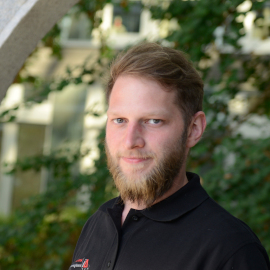

In Chapter 5, you will head into generative Large Language Models (LLMs) and how to fine-tune them. With Retreival Augmented Generation (RAG) you create a specialized assistant that serves as a companion for robot programming.

For Entering Chapter five click here:
<a class="btn btn-success" target="_blank" href="chapter5/"><b>Chapter 5!</b></a>

<!--more-->

<h1> Welcome to the fifth day of our hands-on course!</h1>
Today, you will head into generative Large Language Models (LLMs) and how to fine-tune them. With Retreival Augmented Generation (RAG) you create a specialized assistant that serves as a companion for robot programming. The software used is completely open-source and can be installed on your personal machines. For this course we offer the webservice <a href="https://ragflow.io/">RAGflow</a>, utilizing models from Ollama to digest and extend its knowledge.

**Goal**: By the end of this session, you will know how to fine-tune an existing LLM with a knowledgebase in the fashion of RAG, and define the assistants behavior through (initial) prompt-engineering.

## Prerequisites
- Laptop with internet connection

(Optional) If run on your own machine:
- 16GB RAM
- GPU recommended

## Theoretical Background
- Build your LLM knowledgebase with the content of the past weeks lectures.
- Prompt-engineer to constraint and form an assistants behavior.
- Refine your model to improve the assistent.

## Step-by-Step Hands-On Exercises
1. **Scope and Recap**: We will get an overview of useful lecture material, presented over the past week, to refresh your memory and collect that as training data.
2. **Introduction to RAGflow**: What is Retreival Augmented Generation and how can you set it up for any kind of application you need?
3. **Discuss first impressions**: Gather our first ideas on strength and weakness of generative LLMs and RAG.
4. **Refine your assistant**: Exceed boundaries and try to break the system, explore creative ways of forming your assistant.
5. **Share experiences**: Condense the experience we made by sharing them with your peers.

Access to RAGFlow
---
TBD

Interactive Actions and/or Examples
---



## Summary
By the end of this session you will have experience with the difficulties of configuring your own assistant, and in what ways fine-tuning can change the assistants behavior.

## Congratulations on Completing the Course!
You’ve successfully completed the hands-on course on cognition-enabled robotics, gaining valuable insights into each step of the robot's tasks.

## Further Reading/Exercises
- TBD

Example Videos
---

<figure class="video_container">
  <iframe width="100%" height="360" src="https://www.youtube.com/embed/another_video_id?si=j3CB2Sj4itd_1qlC" title="YouTube video player" frameborder="0" allow="accelerometer; autoplay; clipboard-write; encrypted-media; gyroscope; picture-in-picture; web-share" allowfullscreen="true"></iframe>
</figure>

  

      
  

  

       <h3> Vanessa Hassouna</h3>
    Tel:  +49 421 218 99651  
    Mail:     <a href="mailto:hassouna@cs.uni-bremen.de">hassouna@cs.uni-bremen.de</a>  
      <a style="color:red" href="https://ai.uni-bremen.de/team/vanessa_hassouna">
      Profile Vanessa Hassouna
    </a>
  

  

      
  

  
  

       <h3> Arthur Niedzwiecki</h3>
    Tel:  +49 421 218 64033  
    Mail:     <a href="mailto:aniedz@cs.uni-bremen.de">aniedz@cs.uni-bremen.de</a>  
      <a style="color:red" href="https://ai.uni-bremen.de/team/arthur_niedzwiecki">
      Profile Arthur Niedzwiecki
    </a>
  

  

      
  

  

       <h3> Prof. Michael Beetz PhD</h3>
    Tel:  +49 421 218 64001  
    Mail:     <a href="mailto:beetz@cs.uni-bremen.de">beetz@cs.uni-bremen.de</a>  
      <a style="color:red" href="https://ai.uni-bremen.de/team/michael_beetz">
      Profile Michael Beetz
    </a>
  

