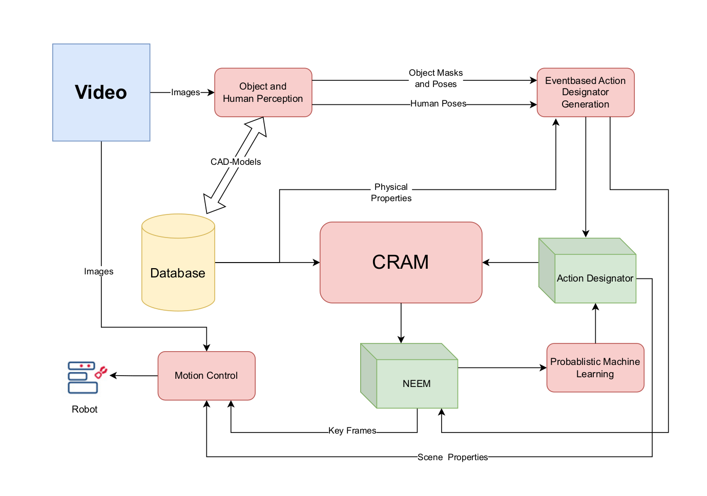

The FAME (Future Action Modelling Engine) Lab stands at the cutting edge of
robotics research, operating as a virtual research laboratory under the auspices of the
ERC project bearing the same name. This ambitious project is dedicated to
exploring how robots can conceptualize and deliberate on future actions to
preemptively address and avoid execution failures. A central focus of the FAME
Lab’s research is enabling robots to learn manipulation tasks by observing
instructional videos. This complex process involves the robot identifying essential
motion patterns within these videos, understanding the rationale behind their
effectiveness without explicit knowledge of the underlying physics, and adapting these
critical motions to its own operational context, which introduces a variety of
uncertainties. Overcoming these challenges would mark a significant milestone,
granting robots the ability to autonomously learn from instructional content, thereby
acquiring a wide range of skills and competencies. A practical application of this
research could enable a robot to adeptly cut any fruit, using any tool, for any
purpose, in any context, showcasing the potential for robots to achieve a remarkable
level of autonomous functionality and versatility.

## Approaching the Problem

  
  
  
  
  
  

<b>Click</b> the part you are interesset in!

## Introduction

### What is the problem we want to tackle?

- Enabling robots to perform open-ended manipulation tasks
- Developing a knowledge representation and reasoning (KR&R) framework
- Learn task-specific motion patterns from demonstration
  - E.g. YouTube, WikiHow

- ***End Goal***:
  - Robots should in uncertain or novel environments be able to:
    - Reason, Simulate and Contextualize actions on the first attempt

### Why is it an interesting problem?

- Robots are currently unable to adapt to new complex tasks in real-world environments
- Robots would be capable of:
  - Autonomous decision-making
  - Learning from minimal data
  - Executing task with human-like adaptability

### Why is it a hard problem?

- ***Generalization***
  - Inability to handle novel tasks and scenarios effectively

- ***Simulation***
  - Lack of accurate, efficient mental simulations for prospective reasoning
- ***Contextualization***
  - Failure to interpret underdetermined or ambiguous task descriptions
- ***Integration***
  - Fragmented processing pipelines that prevent holistic reasoning and action
- ***Efficiency***
  - Computational limitations and data inefficiency hinder real-world applications

### Main Research Hypotheses

- ***Task Contextualization***
  - Infer missing details in underdetermined task requests
- ***Mental Simulation***
  - Use probabilistic mental simulation to anticipate the effects of robots’ actions
  - Reducing task failures and improving adaptability to uncertain environments
- ***Hybrid KR&R***
  - Combination of symbolic + subsymbolic reasoning allows robots to generalize knowledge across different contexts
- ***Causal and Teleological Reasoning***
  - Acquire task-specific causal models through observation and simulation
  - Enabling robots to reason about why certain actions achieve desired effects
  - Adapt actions to new tasks without direct programming
- ***One-Shot Learning***
  - Via observing demonstrations robots can:
    - Extract task-critical motion patterns
    - Understand their causal effect
    - Transfer these patterns to new objects, tools and environments
- ***Inverse Contextualization (IC)***
  - IC infers the underlying task goals, constraints and physics-based motion parameters
    - Allows to replicate and generalize the action
    - E.g. flipping a pancake
- ***Embodied Reasoning***
  - Improving physical skills by simulating how objects/materials behave under manipulation
    - Similar to how humans develop motor skills

## Example Goal Video:

- Show the Robot what to do! 
  <figure class="video_container">
    <iframe width="560" height="315" src="https://www.youtube.com/embed/_IQt39io0dE" title="YouTube video player" frameborder="0" allow="accelerometer; autoplay; clipboard-write; encrypted-media; gyroscope; picture-in-picture; web-share" referrerpolicy="strict-origin-when-cross-origin" allowfullscreen></iframe>
  </figure>

## Navigate to FAME Parts

  For Detailed information on the differents parts of FAME click: 
  

    <a class="btn btn-primary" style="width:100%;" target="_self" href="../"><b>FAME Main Page</b></a>
  

  

    <a class="btn btn-success" style="width:33.3%;" target="_self" href="../perception"><b>Object Perception</b></a>
    <a class="btn btn-success" style="width:33.3%;" target="_self" href="../scene_understanding"><b>Scene Understanding</b></a>
    <a class="btn btn-success" style="width:33.3%;" target="_self" href="../probabilistic_learning"><b>Probabilistic Learning</b></a>
  

  

    <a class="btn btn-success" style="width:33.3%;" target="_self" href="../motion_control"><b>Motion Control</b></a>
    <a class="btn btn-success" style="width:33.3%;" target="_self" href="../geometric_learning"><b>Geometric Deep Learning</b></a>
    <a class="btn btn-success" style="width:33.3%;" target="_self" href="../enviroment"><b>Environment Generation</b></a>
  

 

[comment]: <> (      )
