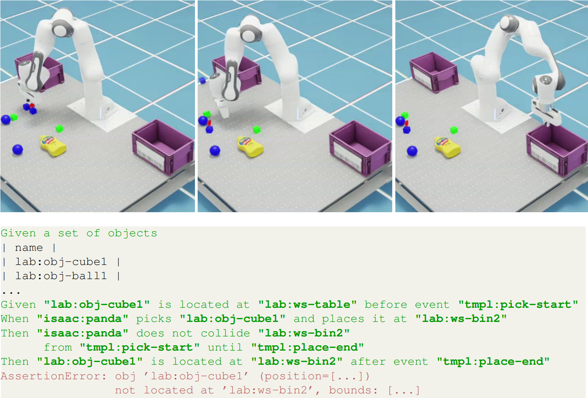
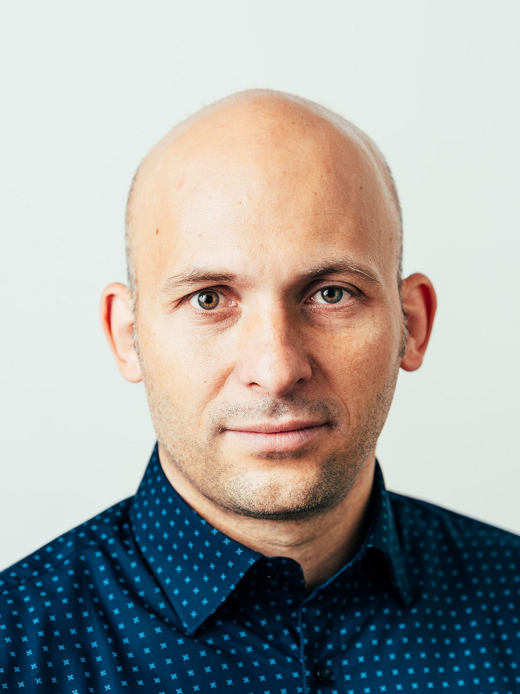

This simulation setup introduces a structured method for testing whether robot behaviors meet defined acceptance criteria (AC), using a pick-and-place task in a simulation environment. Instead of relying on manual evaluations or ambiguous rulebooks, we apply Behaviour-Driven Development (BDD), a technique from software engineering that describes expected behavior in the form Given–When–Then scenarios.

In this setup, you’ll use Isaac Sim to run automated acceptance tests on a robotic system. The tests are defined using a domain-specific language and executed against different robot and environment configurations. This allows you to observe how small changes impact performance, making it easier to validate and understand robotic behavior in a systematic way. This [tutorial](https://secorolab.github.io/bdd-dsl/bdd-concepts.html) for modelling test scenarios can be referred to write your own acceptance tests.

<!-- To begin, load the pick-and-place application in Isaac Sim, select a test scenario, and run the simulation to evaluate the system’s compliance with its acceptance criteria. -->

<!-- <param class="hidde-after-preview">
 -->

<!-- 

  For Detailed information click
  <a class="btn btn-success" target="_blank" href="acceptance-tests-using-behavior-driven-development-secoro"><b>here!</b></a>

 -->


<a class="btn btn-primary" target="_blank" href="https://binder.intel4coro.de/v2/gh/secorolab/bdd-virtual-research-building/HEAD">Run Code</a>

  For Detailed information click
  <a class="btn btn-success" target="_blank" href="acceptance-testing-secoro"><b>here!</b></a>

<!--more-->

   

***"Automated Behaviour-Driven Acceptance Testing of Robotic Systems"*** by Minh Nguyen, Sebastian Wrede, Nico Hochgeschwender (IROS, 19.10.2025)

<!-- Interactive Actions and/or Examples
---

 -->

Description
---

--Detailed description--

Example Videos
---

- [Minh Nguyen, Sebastian Wrede, Nico Hochgeschwender, "Automated Behaviour-Driven Acceptance Testing of Robotic Systems", In IEEE/RSJ International Conference on Intelligent Robots and Systems (IROS), 2025](https://secorolab.github.io/nguyen2025iros/)

Publications
---

- [Minh Nguyen, Sebastian Wrede, Nico Hochgeschwender, "Automated Behaviour-Driven Acceptance Testing of Robotic Systems", In IEEE/RSJ International Conference on Intelligent Robots and Systems (IROS), 2025](https://arxiv.org/pdf/2507.05125)

Authors
---

  

      
  

  

       <h3> Minh Nguyen</h3>
    Tel:  +49 421 --- ----  
    Mail:     <a href="mailto:minh.nguyen@uni-bremen.de">minh.nguyen@uni-bremen.de</a>  
      <a style="color:red" href="https://www.uni-bremen.de/software-engineering-for-cognitive-robots-and-systems/team/scientific-staff">
      Profile Minh Nguyen
    </a>
  

  

      
  

  

       <h3> Prof. Dr.-Ing. Sebastian Wrede</h3>
    Tel:  +49 521 106 5148    
    Mail:     <a href="mailto:sebastian.wrede@uni-bielefeld.de">sebastian.wrede@uni-bielefeld.de</a>  
      <a style="color:red" href="https://ekvv.uni-bielefeld.de/pers_publ/publ/PersonDetail.jsp?personId=76091">
      Profile Sebastian Wrede
    </a>
  

  

      
  

  

       <h3> Prof. Dr. Nico Hochgeschwender</h3>
    Tel:  +49 421 218 64330  
    Mail:     <a href="mailto:nico.hochgeschwender@uni-bremen.de>">nico.hochgeschwender@uni-bremen.de</a>  
      <a style="color:red" href="https://www.uni-bremen.de/software-engineering-for-cognitive-robots-and-systems/team/prof-dr-hochgeschwender">
      Profile Nico Hochgeschwender
    </a>
  

