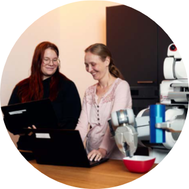
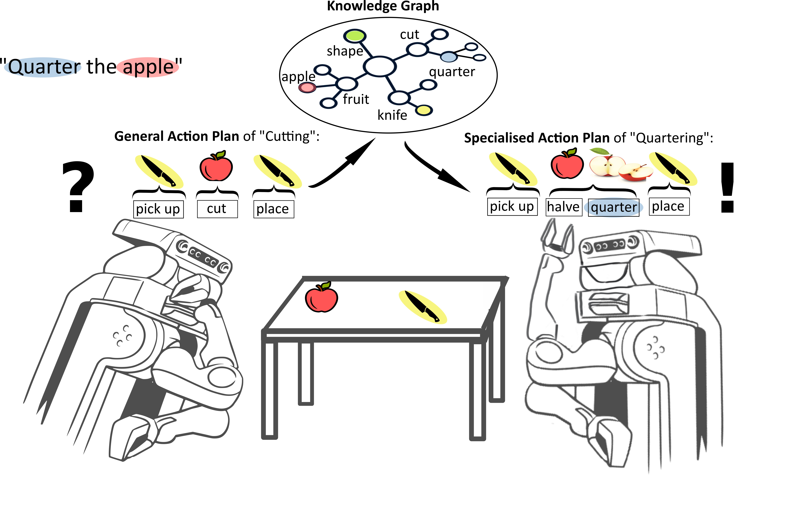
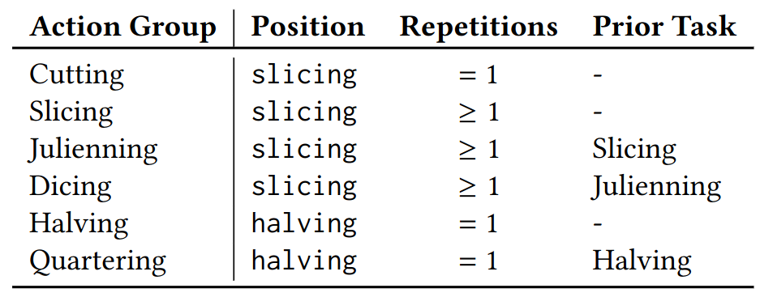
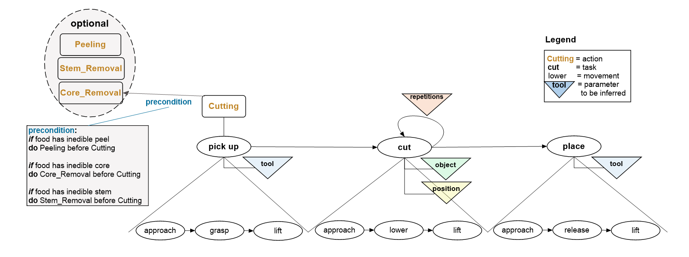

In this virtual research lab, we aim to empower robots with the ability to transform abstract knowledge from the web into actionable tasks, particularly in everyday manipulations like cutting, pouring or whisking. By extracting information from diverse internet sources — ranging from biology textbooks and Wikipedia entries to cookbooks and instructional websites —, the robots create knowledge graphs that inform generalized action plans. These plans enable robots to adapt cutting techniques such as slicing, quartering, and peeling to various fruits using suitable tools making abstract web knowledge practically applicable in robot perception-action loops.





<!--more-->

  

      
  

  

    <h3>Michaela Kümpel (Knowledge Graphs) and Vanessa Hassouna (Robot Action Execution)</h3>
    Tel:     +49 421 218 64021, +49 421 218 99651  
    <!--Fax:     +49 XXXXXXXXXX   -->
    Mail:    <a href="mailto:michaela.kuempel@cs.uni-bremen.de">michaela.kuempel@cs.uni-bremen.de</a>, <a href="mailto:hassouna@cs.uni-bremen.de">hassouna@cs.uni-bremen.de</a>  
    <a style="color:red" href="https://ai.uni-bremen.de/team/michaela_kümpel">
      Profile Michaela Kümpel
      <a style="color:red" href="https://ai.uni-bremen.de/team/vanessa_hassouna">
      Profile Vanessa Hassouna
    </a>
  

 

Interactive Actions and/or Examples
---

For Detailed information click 
<a href="https://food-ninja.github.io/WebKat-MealRobot//">here!</a> 

<h2>Parameterising General Action Plans with Web Knowledge</h2>

To achieve our goal of enabling a robotic agent to handle unkown task variations by parameterising general action plans using web knowledge, we employ the following architecture.

For more information, please check and cite: 
Kümpel, Michaela, Töberg, Jan-Phillip, Hassouna, Vanessa, Cimiano, Phillip and Beetz, Michael, <b>"Towards a Knowledge Engineering Methodology for Flexible Robot Manipulation in Everyday Tasks"</b>, In <i>Actionable Knowledge Representation and Reasoning for Robots (AKR^3) at European Semantic Web Conference (ESWC)</i>, 2024. 

   

<h2>Gathering and Linking Web Knowledge</h2>

To support robotic agents in executing variations of <i>Cutting</i> on different <i>fruits and vegetables</i>, we collect two types of knowledge in our knowledge graph: <b>action</b> and <b>object knowledge</b>.
Both kinds of knowledge need to be linked to enable task execution as explained <a href="https://food-ninja.github.io/WebKat-MealRobot/posts/architektur/">here</a>.

## WikiHow Analysis Tool

To gather additional knowledge about manipulation actions and their associated verbs, we developed a tool analysing a [WikiHow](https://www.wikihow.com) corpus[^11].
The goal is to better the understanding of manipulation verbs and their parameterization for different objects, goals and environments.
The tool uses basic NLP techniques like Part-of-Speech Tagging and Coreference Resolution from the Stanford CoreNLP Toolkit[^12] to extract verb frames.

The WikiHow articles analysed by our tool are structured in the following way:

   

 

## Action Knowledge

The <b>action knowledge</b> covers all properties of a specific manipulation action that are necessary for successfully completing the action and is thus also influenced by the participating objects.
In general we rely on SOMA[^1] and its upper ontology DUL[^2] to model agent participation in events as well as roles objects play during events and how events effect objects.

For executing <i>Cutting</i> actions and its variants, we first collect synonyms and hyponyms for <i>Cutting</i> using WordNet[^3], VerbNet[^4] and FrameNet[^5].
After filtering these verbs regarding their relevance for the cooking domain using our WikiHow Analysis Tool, we propose to divide them into <b>action groups</b> with similar motion patterns.
Based on our observations in <a href="https://www.wikihow.com/">WikiHow</a> data and <a href="https://youtu.be/VjINuQX4hbM">cooking videos</a>, we differentiate between these tasks in three parameters:
- position: Where should the robot place its cutting tool?
- repetitions: How many cuts should the robot perform?
- prior task: Does the robot need to execute a specific action group beforehand?
 
Based on the remaining 14 words, we created the following 6 <b>action groups</b>:

   

## Object Knowledge

As the name suggests, <b>object knowledge</b> covers all relevant information about the objects involved in the task execution (e.g. tools, containers, targets).
Of course, the relevance of each piece of information depends on the task to be executed.
So, for the task of ”Cutting an apple", the apple’s size or anatomical structure is relevant, but whether it is biodegradable or not is irrelevant

For the target group of <i>fruits & vegetables</i>, we gather the following information in our knowledge graph:
- food classes (e.g. stone fruit or citrus fruit)
- fruits and vegetables
- anatomical parts
- edibility of the anatomical parts
- tool to remove the anatomical parts
 
We gather these information from structured sources like FoodOn[^6] and the PlantOntology[^7], but also from unstructured sources like Recipe1M+[^8] or wikihow. 

In total, the knowledge graph contains:
- 6 food classes 
- 18 fruits & 1 vegetable
- 4 anatomical parts (core, peel, stem, shell)
- 3 edibility classes (edible, should be avoided, must be avoided)
- 5 tools (nutcracker, knife, spoon, peeler, hand)

## Knowledge Linking

After collecting the aforementioned action and object knowledge, this knowledge needs to be linked in our knowledge graph, so that a robot can infer the correct tool to use for a given task or the correct object to cut.
We set both kinds of knowledge in relation through <i>dispositions</i> and <i>affordances</i>, as visualised below for an apple:

   

In general, a disposition describes the property of an object, thereby enabling an agent to perform a certain task[^9] as in a knife can be used for cutting, whereas an affordance describes what an object or the environment offers an agent[^10] as in an apple affords to be cut.
Both concepts are set in relation by stating that dispositions allow objects to participate in events, realising affordances that are more abstract descriptions of dispositions[^1].
In our concrete knowledge graph, this is done by using the <i>affordsTask, affordsTrigger</i> and <i>hasDisposition</i> relations introduced in the SOMA ontology[^1].

In general, the robot needs to have access to a general action designator of cutting that can be parameterised.
When the robot is given a task request, it can either query the graph database with the knowledge graph directly via its SPARQL REST API or use a knowledge framework with additional functionalities such as the KnowRob knowledge processing system[^1] and pose Prolog queries, which then are translated to SPARQL queries.
More information on the different ways of querying the knowledge graph can be found <a href="https://food-ninja.github.io/WebKat-MealRobot/posts/querylikearobot/">here</a>.

## References
[^1]: D. Beßler et al., ‘Foundations of the Socio-physical Model of Activities (SOMA) for Autonomous Robotic Agents’, in Formal Ontology in Information Systems, vol. 344, IOS Press, 2022, pp. 159–174. Accessed: Jul. 25, 2022. doi: [10.3233/FAIA210379](https://doi.org/10.3233/FAIA210379).
[^2]: V. Presutti and A. Gangemi, ‘Dolce+ D&S Ultralite and its main ontology design patterns’, in Ontology Engineering with Ontology Design Patterns: Foundations and Applications, P. Hitzler, A. Gangemi, K. Janowicz, A. Krisnadhi, and V. Presutti, Eds. AKA GmbH Berlin, 2016, pp. 81–103.
[^3]: G. A. Miller, ‘WordNet: A Lexical Database for English’, Communications of the ACM, vol. 38, no. 11, pp. 39–41, 1995, doi: [10.1145/219717.219748](https://dl.acm.org/doi/10.1145/219717.219748).
[^4]: K. K. Schuler, ‘VerbNet: A broad-coverage, comprehensive verb lexicon’, PhD Thesis, University of Pennsylvania, 2005.
[^5]: C. F. Baker, C. J. Fillmore, and J. B. Lowe, ‘The Berkeley FrameNet Project’, in Proceedings of the 36th annual meeting on Association for Computational Linguistics  -, Montreal, Quebec, Canada: Association for Computational Linguistics, 1998, p. 86. doi: [10.3115/980845.980860](http://portal.acm.org/citation.cfm?doid=980845.980860).
[^6]: D. M. Dooley et al., ‘FoodOn: a harmonized food ontology to increase global food traceability, quality control and data integration’, npj Sci Food, vol. 2, no. 1, Art. no. 1, Dec. 2018, doi: [10.1038/s41538-018-0032-6](https://www.nature.com/articles/s41538-018-0032-6).
[^7]: P. Jaiswal et al., ‘Plant Ontology (PO): a Controlled Vocabulary of Plant Structures and Growth Stages’, Comparative and Functional Genomics, vol. 6, no. 7–8, pp. 388–397, 2005, doi: [10.1002/cfg.496](http://www.hindawi.com/journals/ijg/2005/373740/abs/).
[^8]: J. Marín et al., ‘Recipe1M+: A Dataset for Learning Cross-Modal Embeddings for Cooking Recipes and Food Images’, IEEE Transactions on Pattern Analysis and Machine Intelligence, vol. 43, no. 1, pp. 187–203, Jan. 2021, doi: [10.1109/TPAMI.2019.2927476](https://pubmed.ncbi.nlm.nih.gov/31295105/).
[^9]: M. T. Turvey, ‘Ecological foundations of cognition: Invariants of perception and action.’, in Cognition: Conceptual and methodological issues., H. L. Pick, P. W. van den Broek, and D. C. Knill, Eds. Washington: American Psychological Association, 1992, pp. 85–117. doi: [10.1037/10564-004](https://doi.org/10.1037/10564-004).
[^10]: M. H. Bornstein and J. J. Gibson, ‘The Ecological Approach to Visual Perception’, The Journal of Aesthetics and Art Criticism, vol. 39, no. 2, p. 203, 1980, doi: [10.2307/429816](https://doi.org/10.2307/429816).
[^11]: L. Zhang, Q. Lyu, and C. Callison-Burch, ‘Reasoning about Goals, Steps, and Temporal Ordering with WikiHow’, in Proceedings of the 2020 Conference on Empirical Methods in Natural Language Processing (EMNLP), Online: Association for Computational Linguistics, 2020, pp. 4630–4639. doi: [10.18653/v1/2020.emnlp-main.374](https://aclanthology.org/2020.emnlp-main.374/).
[^12]: C. D. Manning, M. Surdeanu, J. Bauer, J. Finkel, S. J. Bethard, and D. McClosky, ‘The Stanford CoreNLP Natural Language Processing Toolkit’, in Proceedings of the 52nd Annual Meeting of the Association for Computational Linguistics: System Demonstrations, 2014, pp. 55–60. [Online](http://www.aclweb.org/anthology/P/P14/P14-5010)
[^13]: G. A. Miller, ‘WordNet: A Lexical Database for English’, Communications of the ACM, vol. 38, no. 11, pp. 39–41, 1995, doi: [10.1145/219717.219748](https://dl.acm.org/doi/10.1145/219717.219748).
[^14]: K. K. Schuler, ‘VerbNet: A broad-coverage, comprehensive verb lexicon’, PhD Thesis, University of Pennsylvania, 2005.

