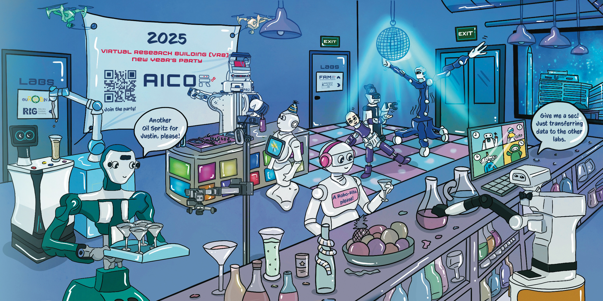

~~---
title: "New Year's"
date: 2023-12-01T10:35:35-05:00
subtitle: ""
tags: [""]
dropCap: false
displayInMenu: false
displayInList: true
draft: false
on_homepage: false
resources:
- name: ActionButtons
  src: "buttons.json"
---

   

Happy New Year!

 

Wishing you an amazing 2025 filled with success, joy, and exciting opportunities.

 

My team and I would love for you to celebrate with us in our Virtual Research Building and help expand our robot community. And for the robots working in your labs, we look forward to seeing them join the party next year!

 

Here is to a successful and healthy 2025 together!

 

Best wishes,

Michael & Team
<a class="btn btn-success" target="_blank" href="https://binder.intel4coro.de/v2/gh/pkehr/pycram/5d830d134fb56f3d563ca5e8ddd60520411d4a38?urlpath=lab%2Ftree%2Fdemos%2Fpycram_multirobot_demo%2Fmultirobot_demo.ipynb">Click: Opening Party Lab</a>~~

