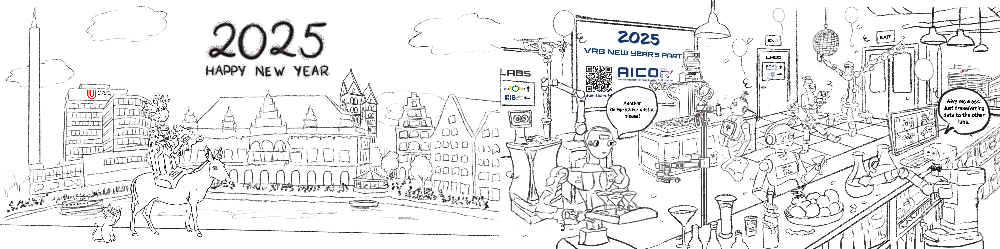

   

New Year's is a time of reflection and celebration, a moment to look back on the past year and look forward to the new one.
It's a time to set goals, make resolutions, and embrace new beginnings. Whether you're celebrating with family and friends or taking a quiet moment to yourself, New Year's is a time to appreciate the journey you've been on and the adventures that lie ahead.

<a class="btn btn-success" target="_blank" href="https://binder.intel4coro.de/v2/gh/pkehr/pycram/5d830d134fb56f3d563ca5e8ddd60520411d4a38?urlpath=lab%2Ftree%2Fdemos%2Fpycram_multirobot_demo%2Fmultirobot_demo.ipynb">Party Lab</a>

