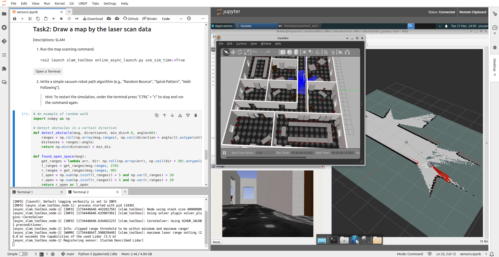

We present a cloud-based robotics platform for teaching and training concepts of cognitive robotics. Instead of forcing interested learners or students to install a new operating system and bulky, fragile software onto their personal laptops just to solve tutorials or coding assignments for a single lecture on robotics, it is beneficial to avoid technical setups and directly dive into the content of cognitive robotics.

To achieve this, we utilize the open-source cloud service [Binderhub](https://github.com/jupyterhub/binderhub) to deploy and operate containerized applications, including robotics simulation environments and software collections based on the Robot Operating System (ROS). The web-based Integrated Development Environment [JupyterLab](https://jupyterlab.readthedocs.io/en/latest/) is integrated with RvizWeb and VNC remote desktop to provide real-time visualization of sensor data and robot behavior in a user-friendly environment for interacting with robotics software.

The proposed platform is a valuable tool for education and research in cognitive robotics and has the potential to democratize access to these fields. This platform has already been successfully employed in various academic courses, demonstrating its effectiveness in fostering knowledge and skill development. Additionally, many live demos on [AICOR Virtual Research Building](https://vib.ai.uni-bremen.de/) are built on this platform.

Platform address: https://binder.intel4coro.de/

<!--more-->

# Table of Contents
---

- [Zero-to-Binder](#zero-to-binder)
  - [Requirements](#requirements)
  - [Create a Hands-on Tutorial from Scratch](#create-a-hands-on-tutorial-from-scratch)
    - [1. Create a repo to Binderize](#1-create-a-repo-to-binderize)
    - [2. Launch your repo](#2-launch-your-repo)
    - [3. Modify your repo](#3-modify-your-repo)
    - [4. Changing the Interface](#4-changing-the-interface)
  - [Now over to you!](#now-over-to-you)
  - [Examples](#examples)
- [Platform Architecture](#platform-architecture)
  - [Cloud Architecture](#cloud-architecture)
  - [Containerized Robotics Application](#containerized-robotics-application)
- [Platform Deployment](#platform-deployment)
- [Publications](#publications)

# Zero-to-Binder
---

This tutorial section covers the usage of the platform, and it is modified from the [official binder manual](https://the-turing-way.netlify.app/communication/binder/zero-to-binder.html). You will learn how to create a robotics hands-on Tutorial with our cloud-based platform.

## Requirements

1. **A GitHub account.** Please sign up for one if you don't have one: https://github.com/signup
1. Know how to use `Git`: [Getting started with Git](https://docs.github.com/en/get-started/getting-started-with-git)
1. Basic knowledge of [Docker](https://docs.docker.com/get-started/) and commonly used [Bash Commands](https://devhints.io/bash).

## Create a Hands-on Tutorial from Scratch

One of the usage scenarios is to create hands-on tutorials when organizing a workshop.
We will take the old Knowrob hands-on tutorial "[EASE Fall School 2021 - NEEMs and KnowRob](https://github.com/sasjonge/ease_fs_neems_2021/)" as an example. Previously, participants had to install `Docker` and `docker-compose`, and start the JupyterLab environment on their laptops. Let's create the same hands-on tutorial running on the cloud so that participants can start the tutorial environment with just a URL.

### 1. Create a repo to Binderize

Create a repo from our template repo. This template repo creates an environment installed with ROS, JupyterLab, and some ROS web tools.

- Go to the template repo page: <a href="https://github.com/IntEL4CoRo/binder-template" target="_blank">IntEL4CoRo/binder-template</a>(ROS2 template:
<a href="https://github.com/IntEL4CoRo/jupyter-ros2" target="_blank">IntEL4CoRo/jupyter-ros2</a>)
- Create a new repo from this template.
  
- Make sure the repo is **public**!
- Name your repo as you like.

#### Why does the repo have to be public?

binder.intel4coro.de cannot access private repositories as this would require a secret token. Your repo shouldn't include Git submodules with private SSH URLs as well.

### 2. Launch your repo

Go to **<a href="https://binder.intel4coro.de" target="_blank">binder.intel4coro.de</a>**.

- Type the GitHub repository name in the "GitHub repository name or URL" box. The name should be in such format:

  **YOUR-USERNAME/YOUR-REPO-NAME**
  

- As you type, the webpage will generate a link in the "Copy the URL below..." box
    It should look like this:
    > https://binder.intel4coro.de/v2/gh/YOUR-USERNAME/YOUR-REPO-NAME/HEAD
 This is the URL to start a JupyterLab environment for your repo.

- Open the url in a new browser tab.
  - You will see a "spinner" as Binder launches the repo
If everything runs smoothly, you'll see a JupyterLab interface. (It will take a longer time for the first launch.)

While you wait, BinderHub (the backend of Binder) is:

- Fetching your repo from GitHub
- Analyzing the contents
- Building a Docker image based on your repo
- Launching that Docker image in the cloud
- Connecting you to it via your browser

Now you have launched a ROS+JupyterLab environment running on the cloud. See "[The JupyterLab Interface](https://jupyterlab.readthedocs.io/en/3.6.x/user/interface.html)" to know more about JupyterLab. Under the folder "notebooks", you can find the notebook `turtlesim.ipynb` which is to test if the ROS is properly installed.

### 3. Modify your repo

With the previous steps, you have created a GitHub repo and launched it on the cloud server. That showcases the basic idea of the Binderhub, turning your GitHub repo into an interactive web application.

Before making changes to the repo, we need to know about the two folders and files that are currently in the repo:

- `README.md`: A `markdown` file to write some basic information about your repo.
- `notebooks`: A folder to place the tutorial Jupyter notebooks.
- `binder`: contains files configuring the runtime environment.
  - `Dockerfile`: the main file for configuring the environment. If you have absolutely no idea what Dockerfile is, please take a few minutes to read the [dockerfile best practices](https://docs.docker.com/develop/develop-images/dockerfile_best-practices/).
  - `entrypoint.sh`: a bash script defines the startup programs. For example, the template environment will start the `ROS core` and the `rvizweb` when the environment is launched.
  - `docker-compose.yml`: only for testing the environment on your local computer, this file will have no effect on Binderhub.

#### Follow the steps below to set up a KnowRob environment

> Note: This part is only for the installation of an older version of KnowRob and is a relatively complex example. The installation relies on external services, and we cannot guarantee that it will be executed successfully. Especially when ROS1 is being discontinued for maintenance, some ROS packages might not be available anymore.

We will add the [KnowRob Jupyter notebooks](https://github.com/sasjonge/ease_fs_neems_2021/tree/master/lectures) to the repo and tell the BinderHub to build a runtime environment with the following software installed, which are mentioned in [Knowrob's documentation](https://knowrob.github.io/knowrob/):

- [KnowRob](https://knowrob.github.io/knowrob/)
- [jupyter-knowrob](https://github.com/sasjonge/jupyter-knowrob)
- [SWI Prolog](https://www.swi-prolog.org/)
- [MongoDB](https://www.mongodb.com/docs/manual/installation/)
- [ROS noetic](https://wiki.ros.org/noetic) (Already installed in the base environment)

**3.1** Add Jupyter notebooks to the folder `notebooks`, simply download the notebooks from the repo [ease_fs_neems_2021](https://github.com/sasjonge/ease_fs_neems_2021/tree/master/lectures).

**3.2** The downloaded notebooks require some external resources under the folder [prolog](https://github.com/sasjonge/ease_fs_neems_2021/tree/master/prolog), so we also need to copy the entire `prolog` folder.

**3.3** Copy the following installation instructions to the `binder/Dockerfile` (inside the block "Install extra software packages"):

    ```Docker
    #============= Install extra software packages =============#
    # Install SWI Prolog 
    # Source: https://www.swi-prolog.org/build/PPA.html
    USER root
    RUN apt install -y software-properties-common && \
      apt-add-repository -y ppa:swi-prolog/stable
    RUN apt update && \
      apt install -y swi-prolog
    ENV SWI_HOME_DIR=/usr/lib/swi-prolog

    # Install MongoDB Community Edition
    # Source: https://www.mongodb.com/docs/manual/tutorial/install-mongodb-on-ubuntu/#std-label-install-mdb-community-ubuntu
    ARG MONGODEB_VERSION=4.4
    RUN curl -fsSL https://www.mongodb.org/static/pgp/server-${MONGODEB_VERSION}.asc | \
        gpg -o /usr/share/keyrings/mongodb-server-${MONGODEB_VERSION}.gpg --dearmor
    RUN echo "deb [ arch=amd64,arm64 signed-by=/usr/share/keyrings/mongodb-server-${MONGODEB_VERSION}.gpg ] https://repo.mongodb.org/apt/ubuntu focal/mongodb-org/${MONGODEB_VERSION} multiverse" | \
        tee /etc/apt/sources.list.d/mongodb-org-${MONGODEB_VERSION}.list
    RUN apt update && apt install -y mongodb-org
    RUN mkdir -p /data/db && \
        chown -R ${NB_USER}:users /data/db 

    # Install Knowrob
    # Source: https://knowrob.github.io/knowrob/
    USER ${NB_USER}
    WORKDIR ${ROS_WS}/src
    RUN wstool merge https://raw.github.com/knowrob/knowrob/master/rosinstall/knowrob-base.rosinstall && \
        wstool update

    # Switch to root user to install ROS dependencies
    # Source: http://wiki.ros.org/rosdep
    USER root
    RUN rosdep update && rosdep install -y -r --ignore-src --from-paths . && \
        rosdep fix-permissions

    # Install jupyter knowrob kernel
    # Source: https://github.com/sasjonge/jupyter-knowrob
    USER ${NB_USER}
    WORKDIR ${HOME}
    RUN git clone https://github.com/sasjonge/jupyter-knowrob.git --recurse-submodules
    RUN cd jupyter-knowrob && pip install .
    ARG JK_KERNEL=${HOME}/.local/share/jupyter/kernels/jknowrob
    RUN mkdir -p ${JK_KERNEL} && \
        cp jupyter-knowrob/kernel.json ${JK_KERNEL}
    RUN cp -R ${HOME}/jupyter-knowrob/knowrob_cloud ${ROS_WS}/src/
    COPY --chown=${NB_USER}:users prolog /prolog

    # Build catkin workspace
    # Source: https://catkin-tools.readthedocs.io/en/latest/verbs/catkin_build.html
    USER ${NB_USER}
    WORKDIR ${ROS_WS}
    RUN catkin build

    # Download the example neem data
    USER root
    RUN mkdir /neem_data && chown ${NB_USER}:users /neem_data
    USER ${NB_USER}
    RUN cd /neem_data && \
        wget https://ivan.informatik.uni-bremen.de/data/example_neem.zip -O example_neem.zip && \
        unzip example_neem.zip && \
        mv example_neem/* ./ && \
        rm -r example_neem example_neem.zip
    #===========================================================#
    ```

   The installation methods for each software are listed in the comments. Dockerfile instructions are similar to Linux `shell` commands, the main difference is they start with keywords like `RUN`, `WORKDIR`, and `USER`. Descriptions of Dockerfile instructions can be found in the docs [Dockerfile instructions](https://docs.docker.com/develop/develop-images/instructions/). A docker container is basically a Linux environment, so containerizing a repo is writing a series of Linux commands explicitly to the `Dockerfile`. Therefore, the primary knowledge for writing Dockerfile instructions is knowing how to use [Linux commands](https://ubuntu.com/tutorials/command-line-for-beginners#1-overview).

**3.4** To launch KnowRob once the environment starts, copy the following code to `binder/entrypoint.sh` (before the command `exec "$@"`):

    ```bash
    # Start MongoDB and save data on working directory
    MONGODB_URL=mongodb://127.0.0.1:27017
    mongod --fork --logpath ${HOME}/mongod.log

    # Create a symbolic link to the folder neem_data
    ln -s /neem_data ${PWD}/neem_data

    # Launch Knowrob
    export KNOWROB_MONGODB_URI=${MONGODB_URL}/?appname=knowrob
    roslaunch --wait knowrob knowrob.launch &
    ```

**3.5** Commit all the changes and push the updates to GitHub.

**3.6** Now your repo should be similar to this [completed repo](https://github.com/yxzhan/knowrob-example).

Open the launch URL again. If you forgot the URL, just repeat "[Launch your repo](#2-launch-your-repo)". The BinderHub will rebuild your repo. As we added a lot of installation steps to the Dockerfile, the build process will take some time to complete.

### 4. Changing the Interface

If you want to directly open a Jupyter Notebook, you can add the URL parameter `labpath` or `urlpath`. The difference between these two parameters is that `labpath` will start JupyterLab in a simple mode, which displays only the notebook. And `urlpath` is much more flexible and allows JupyterLab to open in a more complex UI, with multiple tabs open or a custom web application.

**Examples of URL parameters:**

- Open single notebook: https://binder.intel4coro.de/v2/gh/yxzhan/knowrob-example.git/main?labpath=notebooks/tut2-semweb.ipynb

- Open notebook in the multi-tab interface: https://binder.intel4coro.de/v2/gh/yxzhan/knowrob-example.git/main?urlpath=lab/tree/notebooks/tut2-semweb.ipynb

- Open a custom web application(remote desktop): https://binder.intel4coro.de/v2/gh/yxzhan/knowrob-example.git/main?urlpath=xprahtml5/index.html

### Now over to you!

Now that you have created your own robotics live demo, it's time to add the example scripts and data you have prepared!

### Examples

|||
| :-: | :-: |
|[ Robokudo Perceptions](https://binder.intel4coro.de/v2/git/https%3A%2F%2Fgitlab.informatik.uni-bremen.de%2Ffmuehlis%2Frobokudo-lab.git/tutorials?urlpath=lab%2Ftree%2Frobokudo.jupyterlab-workspace)|[ Giskardpy Motion Planing](https://binder.intel4coro.de/v2/gh/maltehue/giskard-examples/kevin_vrb?labpath=demo.ipynb)|
|[Gazebo Simulation](https://binder.intel4coro.de/v2/gh/IntEL4CoRo/iis-exercises/dev?labpath=03_sensors%2Fsensors.ipynb)|[Blockly Robotics](https://binder.intel4coro.de/v2/gh/IntEL4CoRo/blockly-playground.git/main?urlpath=lab/tree/examples/playground.jpblockly)|

<br/><br/>

# Platform Architecture
---

Our chosen cloud architecture is from the open-source project [Binderhub](https://github.com/jupyterhub/binderhub), an open-source web service that lets users create shareable, interactive, reproducible environments in the cloud. The underlying container orchestration system is [Kubernetes](https://kubernetes.io/), the de facto standard for deploying and operating containerized applications. Therefore, this setup can run on major cloud platforms and self-hosted Linux servers. Additionally, it provides a way to adjust computational resources without disrupting running services by adding or removing nodes (servers) from the cluster.

## Cloud Architecture

Users of the platform can be categorized into two types: lecturers (creators) and students (consumers). The platform is designed for open-source workflows. Lecturers build learning applications by creating Git repositories containing learning materials and runtime environment configuration files (Dockerfile). BinderHub builds Docker images accordingly and returns URLs of the applications. With application URLs, students can access the learning applications without installing anything on their PCs.


## Containerized Robotics Application

The robotics learning applications use containerization technologies (Docker) to package the software along with necessary runtime libraries (e.g., ROS, motion control framework, robot simulator) and configuration files into one executable process. Each container is an isolated Linux environment, ensuring that each application functions without being affected by others and behaves consistently. The built containerized application is ready to run on both the cloud platform and local PCs. Students can do the task on a robot simulator running on the cloud or with a real-world robot running on a local PC.


<br/><br/>

# Platform Deployment
---

This section provides deployment instructions to deploy the platform to a newly installed Linux server.

## Requirements

- An X86 machine
- A [DockerHub](https://hub.docker.com/) account
- Public IP address
- Two domain names, one for BinderHub, one for JupyterHub
- Ubuntu 20.04 or newer
- A user with `sudo` permission

## Step-by-Step Instructions

### Connect to the Server

1. SSH to the server: `ssh USERNAME@SERVER-IP`

1. Install a remote desktop environment.
    - Install `xrdp` and `xfce4` (a lightweight desktop GUI)
      - `sudo apt update`
      - `sudo apt install xrdp xfce4 xfce4-goodies -y`
      - `echo xfce4-session > ~/.xsession`
    - In case it is not enabled after installation: `sudo systemctl enable --now xrdp`
    - Check `xrdp` status: `sudo systemctl status xrdp`
    - From the status, find the port, by default it is `3389`.

1. Connect to the remote desktop
    - For safety, do not expose port 3389 to the public network interface. Make it available on `localhost` and forward the port to your local PC via `SSH` command `ssh -L 3389:localhost:3389 USERNAME@SERVER-IP`
    - Use [Remmina](https://remmina.org/) on your PC to remotely control the server desktop environment on `localhost:3389`. (Note: port 3389 might be used by another process on your local PC, check which port it is actually forwarded to).
    - Now you should be able to use the server just like a PC.

### Create Virtual Machines

The platform will need a large amount of disk space to store Docker images. A server normally has very limited SSD storage and large `raid` disk storage. The following steps will use a `raid` disk mounted on path `/raid`. Check your server storage with the command: `df -h`.

There are many benefits to run the instances on the VM. It simplifies the firewall rules configuration, which is especially important for `Kubernetes`. When the services are down, simply reboot the VMs, not the whole machine. It's also easier to dynamically adjust computational resources. The downsides are making it harder to manage the applications and not being able to directly join the cluster of other servers.

1. Install KVM
    - Open a terminal: `sudo apt update`
    - Install KVM packages: `sudo apt install -y qemu-kvm libvirt-daemon-system libvirt-clients bridge-utils virt-manager`
    - Check status:
        - `lsmod | grep kvm`
        - `sudo systemctl status libvirtd`
        - If not running, start and enable it: `sudo systemctl enable --now libvirtd`
    - Verify KVM installation: `virsh list --all`
    - Add user to `libvirt` group: `sudo usermod -aG libvirt $(whoami)`
    - Logout of the SSH session and log in again.

1. Create Virtual Machines:
    - Install `Firefox`: `sudo snap install firefox`
    - Connect to the remote desktop.
    - Open Firefox and download the [Ubuntu 24.04 ISO image](https://ubuntu.com/download/server)
    - Create a directory `/raid/kvm-instances` on the raid disk:
        - `sudo mkdir /raid/kvm-instances`
        - `sudo chown $(whoami):$(whoami) /raid/kvm-instances`
    - Move the downloaded `~/Downloads/ubuntu-24.04.1-live-server-amd64.iso` file to `/raid/kvm-instances`.
    - Optional Step: Add an SSH private key that you used for your Github account to the folder `~/.ssh`. The VM can fetch the public key from Github, so you don't need to configure the SSH key manually.
    - Watch the video below for the details of creating VM instances, and some steps to be aware of:
        - The storage space cannot be modified after the VM is created, be sure to calculate how much space will be needed.
        - You need to edit the space mounted on `/`, allocating all the free space. By default, it will only allocate 100G.
        - The number of CPUs and memory can be changed after creation.
        - Don't forget to enable "Start virtual machine on host boot up" under "Boot Options".
        - The VM won't be able to reboot after the Ubuntu installation. You need to force shutoff and run it again.

      <video width="100%" controls>
        <source src="./kvm.mp4" type="video/mp4">
      </video>

### Setup Kubernetes Cluster

1. Verify the installation of `Docker` and `Microk8s` in the VM.
    - `Microk8s` and `Docker` are selected as pre-installed software when creating VMs.
    - Log in to VMs and run:
        - `sudo docker ps`
        - `sudo microk8s status`
    - If you missed the installation steps, install them manually:
        - `sudo snap install microk8s --classic`
        - `sudo snap install docker`

1. Add the user to `docker` and `microk8s` groups in the VM:
    - `sudo groupadd docker`
    - `sudo usermod -aG docker $USER`
    - `sudo snap disable docker`
    - `sudo snap enable docker`
    - `sudo usermod -a -G microk8s $USER`
    - `echo "alias kubectl='microk8s.kubectl'" >> ~/.bashrc`
    - `echo "alias helm='microk8s.helm'" >> ~/.bashrc`
    - Logout and log in to the VM again.
    - Verify if commands `docker` and `microk8s` can be run without `sudo`.
      - `docker ps`
      - `microk8s status`

1. Check the Kubernetes pods:
    - `kubectl get pods -A`
    - The status of all the pods should be `Running`.

### Install Kubernetes Extensions

1. **Log in to the VM.**
1. Install LoadBalancer:
    - The IP range below is the default KVM virtual network, check your VM network interface: `ip addr`.
    - `microk8s enable metallb:192.168.122.100-192.168.122.120`
1. Install Storage:
    - `microk8s enable hostpath-storage`
1. Install Dashboard:
    - `microk8s enable dashboard`
    - Assign an external IP for the dashboard: `microk8s.kubectl edit svc/kubernetes-dashboard -n kube-system`
    - Modify the last few lines:
        ```yaml
        ...
          type: ClusterIP
        status:
          loadBalancer: {}
        ```
        to
        ```yaml
        ...
          type: LoadBalancer
        status:
          loadBalancer:
            ingress:
            - ip: 192.168.122.100
              ipMode: VIP
        ```
    - Generate token and copy the output token to somewhere safe: `kubectl create token default --duration=10000h`

1. Check the Kubernetes pods again: `kubectl get pods -A`

### Deploy BinderHub

1. Create a config file `binder.yaml`.
    ```yaml
    registry:
        username: <docker-id>
        password: <password>
    config:
        BinderHub:
        use_registry: true
        image_prefix: <docker-id OR organization-name>/<prefix>-
        hub_url: https://<Domain name for Jupyterhub>
    ```

    Above is the minimal config of the deployment. This needs to be configured according to the resources of the specific server and network environment, you can refer to [binder.intel4coro.de-deploy](https://github.com/IntEL4CoRo/binder.intel4coro.de-deploy/blob/main/binder.yaml) and [mybinder.org-deploy](https://github.com/jupyterhub/mybinder.org-deploy/blob/main/mybinder/values.yaml) for advanced configuration.

1. Deploy BinderHub helm Chart:
    - **Log in to the VM**
    - Add helm repo:
        - `microk8s.helm repo add jupyterhub https://jupyterhub.github.io/helm-chart/`
        - `microk8s.helm repo update`
    - Go to the directory of `binder.yaml`.
    - Deploy Binderhub:
        ```bash
        microk8s.helm upgrade --cleanup-on-fail \
        --install binder \
        jupyterhub/binderhub --version=1.0.0-0.dev.git.3424.h2ef5e98 \
        --namespace=binder \
        --create-namespace \
        -f ./binder.yaml
        ```
    - Monitor pod status: `watch microk8s.kubectl get pods -A`, wait until all the pods are ready.
    - Get the services EXTERNAL IP: `kubectl get svc -A`, see such output:
        ```
            NAMESPACE        NAME                        TYPE           CLUSTER-IP       EXTERNAL-IP       PORT(S)                  AGE
            binder           binder                      LoadBalancer   10.152.183.100   192.168.122.102   80:32625/TCP             2m16s
            binder           hub                         ClusterIP      10.152.183.118   <none>            8081/TCP                 2m16s
            binder           proxy-api                   ClusterIP      10.152.183.97    <none>            8001/TCP                 2m16s
            binder           proxy-public                LoadBalancer   10.152.183.73    192.168.122.101   80:30129/TCP             2m16s
            default          kubernetes                  ClusterIP      10.152.183.1     <none>            443/TCP                  3h2m
            kube-system      dashboard-metrics-scraper   ClusterIP      10.152.183.139   <none>            8000/TCP                 53m
            kube-system      kube-dns                    ClusterIP      10.152.183.10    <none>            53/UDP,53/TCP,9153/TCP   3h2m
            kube-system      kubernetes-dashboard        LoadBalancer   10.152.183.197   192.168.122.100   443:31954/TCP            53m
            kube-system      metrics-server              ClusterIP      10.152.183.56    <none>            443/TCP                  53m
            metallb-system   webhook-service             ClusterIP      10.152.183.113   <none>            443/TCP                  55m
        ```

### Setup Proxy Server

The external IPs in the previous step are just the IPs of the KVM virtual network, and these IPs are only accessed by services within the server local network. To make the service accessible from the public network, we need to set up a proxy server listening to requests from the public network.

1. Create 2 A records pointing your domain names to your server public IP on your domain name provider.
1.  **On the host machine**, [install Docker](https://docs.docker.com/engine/install/ubuntu/).
1. Deploy [Nginx proxy manager](https://github.com/NginxProxyManager/nginx-proxy-manager):
    - `mkdir -p ~/workspace/nginx-proxy-manager/data`
    - `mkdir -p ~/workspace/nginx-proxy-manager/letsencrypt`
    - Create a `docker-compose.yaml` under the directory `~/workspace/nginx-proxy-manager`
        ```yaml
        version: '3'
        services:
            app:
            image: 'jc21/nginx-proxy-manager:2.11.2'
            restart: unless-stopped
            ports:
                - '80:80'
                - '127.0.0.1:10086:81'
                - '443:443'
            volumes:
                - ./data:/data
                - ./letsencrypt:/etc/letsencrypt
        ```
    - Start the proxy server: `docker compose -f "~/workspace/nginx-proxy-manager/docker-compose.yml" up -d`

### Configure Proxy Server

- Forward port `10086` to your local PC, or use the server remote desktop to open Firefox.
- Open the admin page: http://localhost:10086
- Default admin account:
    ```
    Email:    admin@example.com
    Password: changeme
    ```
- Change the admin password.
- Add `Proxy Host` for the domain names.
    - First, check if the DNS records are active: `ping <your domain name>`, see if it echoes the server's public IP.
    - **Log in to the VM**, Check the k8s service again: `kubectl get svc -A`
    - Proxy domain name `<domain_name_for_BinderHub>` to the IP of `binder` (192.168.122.102:80), and add custom config:
        ```
        location /robots.txt {
            alias /data/robots.txt;
        }
        ```
      Under `nginx-proxy-manager/data`, create a file `robots.txt` (might need `sudo` permission):
        ```
        # Block Googlebot and Adsbot
        User-agent: Googlebot
        User-agent: AdsBot-Google
        Disallow: /
        ```
      The `robots.txt` is to tell the search engines not to index your website, otherwise the crawler of Google might launch dozens of instances from time to time.
    - Proxy domain name `<domain_name_for_ JupyterHub>` to the IP of `proxy-public` (192.168.122.101:80), enable cache, websocket and add custom config:
        ```
        proxy_read_timeout 60m;
        proxy_cookie_flags ~ secure samesite=none;
        ```
    - Optional steps: If you have another extra domain, proxy it to the IP of Dashboard: `kubernetes-dashboard` (192.168.122.100:443). Otherwise you need to do some extra work to access to it, see [microk8s-dashboard](https://microk8s.io/docs/addon-dashboard) for more details.
- If you get errors when fetching the SSL certificate from `letsencrypt`, check the container logs or nginx log files under `~/workspace/nginx-proxy-manager/data/logs`.

### Verify Deployment

Now you should be able to access your own BinderHub platform with your domain name. Check the section [Zero-to-Binder](#zero-to-binder) for the user guide.

<br/><br/>

# Publications
---

- [Cloud-Based Digital Twin for Cognitive Robotics (A. Niedźwiecki, S. Jongebloed, Y. Zhan, M. Kümpel, J. Syrbe and M. Beetz), 2024 IEEE Global Engineering Education Conference (EDUCON)](https://ieeexplore.ieee.org/document/10578841)
