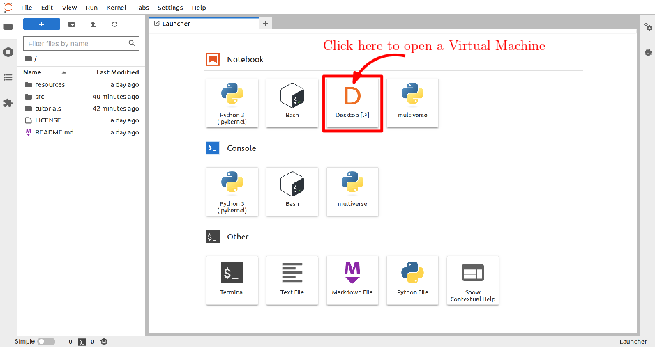

The [Multiverse Framework](https://github.com/Multiverse-Framework/Multiverse), supported by [euROBIN](https://www.eurobin-project.eu/), is a decentralized simulation framework designed to integrate multiple advanced physics engines along with various photo-realistic graphics engines to simulate everything. The Interactive Virtual Reality Labs, utilizing Unreal Engine for rendering (optimized for Meta Quest 3 Headset) and MuJoCo for physics computation, support the simultaneous operation of multiple labs and enable real-time interaction among multiple users.

  For Detailed information click
  <a class="btn btn-success" target="_blank" href="multiverse-labs"><b>here!</b></a>

<!--more-->

<!-- 

  

      
  

  

    <h3>Replace with Name</h3>
    Tel:     +49 XXXXXXXXXX  
    Fax:     +49 XXXXXXXXXX  
    Mail:    <a href="mailto:XXXXXXX@cs.uni-bremen.de">XXXXXX@cs.uni-bremen.de</a>  
    <a style="color:red" href="https://ai.uni-bremen.de/team/XXXXXXXXX">
      Profile
    </a>
  

 -->

Multiverse on the Cloud
---

The Multiverse Framework can be accessed via the Cloud through any browser on any platform. Once inside the Jupyter Notebook, click on "Desktop" to launch a virtual machine.

  <!-- <a class="btn btn-primary" target="_blank" href="">Run Code</a> -->
  <a class="btn btn-success" target="_blank" href="https://binder.intel4coro.de/v2/gh/Multiverse-Framework/Multiverse-Docker/main">Link to BinderHub</a>

Key components
---

The Multiverse Framework is built with three main pillars: the Multiverse Server/Client, Multiverse Parser, and Multiverse Knowledge. Each pillar operates independently, making separate installation and operation possible. To simplify the launching and visualizing of clusters, Multiverse includes Multiverse Launch and Multiverse View. The software runs on both Linux and Windows, with seamless communication across systems via TCP socket.

For further information, please refer to this [documentation](multiverseframework.readthedocs.io).

<h2>Single User</h2>
<figure class="video_container">
  <video width="100%%" height="300" autoplay loop muted controls>
    <source src="./SingleUserDemo.mp4" type="video/mp4">
    Your browser does not support the video tag.
  </video>
</figure>

<h2>Multiple Users</h2>
<figure class="video_container">
  <video width="100%%" height="300" autoplay loop muted controls>
    <source src="./MultiUserDemo.mp4" type="video/mp4">
    Your browser does not support the video tag.
  </video>
</figure>

 
