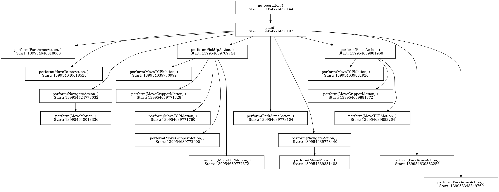

The PyCRAM Laboratory focuses on leveraging the capabilities of PyCRAM, a
Python 3 re-implementation of the original CRAM framework designed to serve as a
comprehensive toolbox for the creation, implementation, and deployment of
AI-driven and cognition-enabled control software on autonomous robots. This
laboratory is dedicated to advancing the frontiers of robot autonomy by providing a
modern and accessible platform that supports the development of sophisticated robot
control systems, fostering innovation in the design of intelligent and autonomous
robotic solutions.

<a class="btn btn-primary" target="_blank" href="https://binder.intel4coro.de/v2/gh/artnie/pycram.git/rpwr-0.2?urlpath=lab/tree/examples/tutorial_iros_2023.ipynb">Run Code</a>
<a class="btn btn-success" target="_blank" href="https://github.com/cram2/pycram">Source Code</a>

  For Detailed information click
  <a class="btn btn-success" target="_blank" href="pycram-laboratory"><b>here!</b></a>

<!--more-->

<!-- 

  

      
  

  

    <h3>Replace with Name</h3>
    Tel:     +49 XXXXXXXXXX  
    Fax:     +49 XXXXXXXXXX  
    Mail:    <a href="mailto:XXXXXXX@cs.uni-bremen.de">XXXXXX@cs.uni-bremen.de</a>  
    <a style="color:red" href="https://ai.uni-bremen.de/team/XXXXXXXXX">
      Profile
    </a>
  

 -->

The framework provides various tools for aiding in robot software
development as well as geometric reasoning and a fast simulation mechanisms to develop
cognition-enabled control programs that achieve high levels of robot autonomy.
Other features that PyCRAM provides are: a high-level abstraction mechanism, a
plan language to structure the execution of plans, mechanisms for robot independent
code, a variety of interfaces to control a real robot, etc.

Interactive Actions and/or Examples
---
If you want to see how PyCRAM is used you can take a look at examples of different
mechanisms [here](https://pycram.readthedocs.io/en/latest/examples.html).

To try out the examples yourself you need to [install](https://pycram.readthedocs.io/en/latest/installation.html)
PyCRAM, afterwards you can install and start Jupyter and try the [examples](https://github.com/cram2/pycram/tree/dev/examples).

<a class="btn btn-primary" target="_blank" href="https://binder.intel4coro.de/v2/gh/IntEL4CoRo/pycram/binder-xpra?urlpath=lab%2Ftree%2Fexamples%2Faction_designator.ipynb%3Frobot%3Dpr2%26environment%3Dkitchen">Run Code</a>
<a class="btn btn-success" target="_blank" href="https://github.com/cram2/pycram">Source Code</a>

Documentation
---

The general documentation of PyCRAM is in readthedocs [here](https://pycram.readthedocs.io/en/latest/index.html) and the
API documentation with more technical and detailed information can be found [here](https://pycram.readthedocs.io/en/latest/autoapi/index.html).

Screenshots
---

* A Pr2 robot executing a simple plan.

* A distribution where the robot can be placed without colliding with the environment.

* A task tree of a simple pick and place plan

