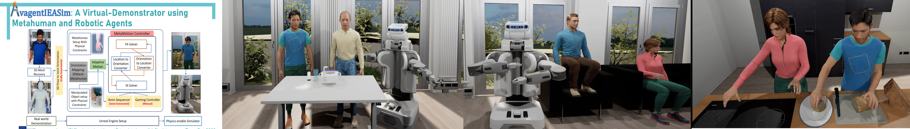

This project integrates advanced machine learning techniques with Unreal Engine's MetaHuman avatars,
providing a sophisticated platform for robotic agents to acquire knowledge of everyday activities and
object manipulation. As part of the comprehensive Physics-enabled Virtual Demonstration (PVD) framework,
this platform utilizes video instructions to facilitate realistic simulations, ensuring that robots can interpret
and practice complex tasks in a lifelike, physically governed virtual environment. This methodology not only bridges
the gap between theoretical learning and practical execution but also enriches the robotic understanding
of human actions, significantly boosting their adaptability and efficiency in real-world scenarios.

<!--more-->

DeepActionObserver: Refining Instructions for objects Manipulation Actions
---

The DeepActionObserver framework addresses the challenge of teaching robotic agents to perform diverse
manipulation tasks, amid varying object interactions, tool usage, and environmental conditions. It empowers
robots to interpret text instructions and analyze video demonstrations, generating symbolic action
descriptions that are enriched and clarified by the video content. This framework combines the strengths
of Multi-Task Networks, with their convolutional architectures for object and movement recognition, and
Markov Logic Networks, which enhance reasoning through joint probabilities. Together, these technologies
synergize to improve the framework's performance, aligning with advanced cognition-enabled control schemes
and effectively simplifying complex task execution for robots.

DeepActionObserver
---

<figure class="video_container">
  
  <iframe width="560" height="315" src="https://www.youtube.com/embed/doov3Mz3b5c?si=O3IljhBEmReit1zn" title="YouTube video player" frameborder="0" allow="accelerometer; autoplay; clipboard-write; encrypted-media; gyroscope; picture-in-picture; web-share" allowfullscreen></iframe>
  
</figure>

AvagentIEASim: Avatar Agent Inspect Extrapolate Accomplish Simulator
---

To enable physics-based simulations, we utilized MetaHuman from the Unreal Engine Simulator. We crafted
a proficient whole-body FK-IK solver employing the Control Rig, Unreal Engine's animation toolkit, to facilitate
real-time character animation. We introduced HarmonicNet, a Deep Neural Network tailored for comprehensive
body mesh recovery, emphasizing synchronized, feature-aware processing. HarmonicNet tackles the intricate challenge
of inferring 3D parameters for the human body, face, and hands from single images. It revolutionizes the
understanding of interrelations among body segments, notably enhancing the precision of upper body rotations and orientations.

Physics-enable Virtual Demonstration
---

We've been actively engaged in developing the Physics-enabled Virtual Demonstration (PVD) framework to
improve robotics manipulation. PVD, an advanced machine learning tool within a simulated environment,
teaches robots and MetaHumans to grasp physics fundamentals, such as gravity and object interactions.
Its goal is to enhance the adaptability, efficiency, and safety of robots and MetaHumans through practical
exercises that closely mimic real-world conditions. Additionally, PVD's Human Demonstration feature breaks 
down human actions into simple instructions, boosting robots' understanding and planning capabilities, 
thereby improving task performance and reducing errors.

Virtual Demonstrations through Human Manipulation Observation
---

<figure class="video_container">

<iframe width="560" height="315" src="https://www.youtube.com/embed/5SnSibZ8gQI?si=BvouCT80WUv_EljI" title="YouTube video player" frameborder="0" allow="accelerometer; autoplay; clipboard-write; encrypted-media; gyroscope; picture-in-picture; web-share" allowfullscreen></iframe>

</figure>

Human-Inspired Robotic Action: Sharing and Exploring Knowledge:
---
Leveraging our framework, the 3D mesh reconstructed from video demonstrations, along with the extracted hierarchical joint
orientations, can be shared with other agents possessing nearly similar skeletal structures through joint mapping. As a
demonstration, we use the humanoid NAO robot, mapped with human-centric pouring motion data. The experiment goes beyond mere
replication of human actions; it delves into the realm of knowledge transfer, where human-inspired techniques are not only
shared but also expanded upon within the robotic domain. This exploration paves the way for robots to enhance their interaction
with the physical world in tasks that demand a high level of finesse and adaptability.

<figure class="NAO Robot Pouring Demonstration from Human Observation">

<iframe width="560" height="315" src="https://www.youtube.com/embed/l8vd1K--5ZY?si=9P569MDu85ql9o2g" title="YouTube video player" frameborder="0" allow="accelerometer; autoplay; clipboard-write; encrypted-media; gyroscope; picture-in-picture; web-share" allowfullscreen></iframe>

</figure>

