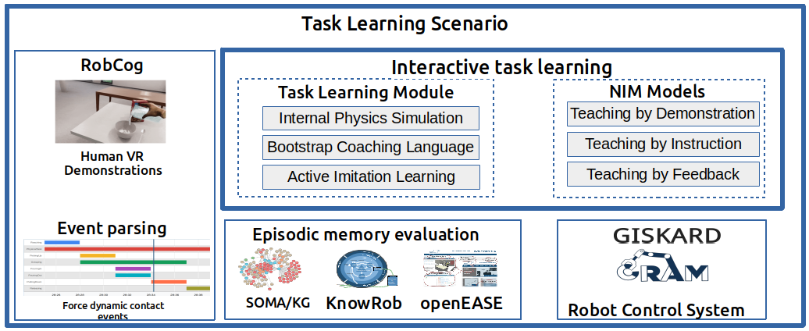

This research project addresses the challenge of instructing a robot agent to learn novel tasks interactively, specifically in the household domain. The focus of this repository lies on the task of teaching the pouring task by using written instructions with PyCRAM.

For more information, you can
<a class="btn btn-success" target="_blank" href="https://ease-crc.github.io/itl/"><b>visit the webpage</b></a> of Interactive Task Learning to get a better idea on how a robot can learn from different teaching methodologies.

<a class="btn btn-primary" target="_blank" href="https://binder.intel4coro.de/v2/gh/AbhijitVyas/pycram.git/binder?urlpath=lab%2Ftree%2Fexamples%2Fboostrapping_instructions.ipynb">Run code</a>
<a class="btn btn-success" target="_blank" href="https://github.com/AbhijitVyas/pycram/tree/binder">Source Code</a>

<!--more-->

 
Interactive Actions and/or Examples
---

<a class="btn btn-primary" target="_blank" href="https://binder.intel4coro.de/v2/gh/AbhijitVyas/pycram.git/binder?urlpath=lab%2Ftree%2Fexamples%2Fboostrapping_instructions.ipynb">Run code</a>
<a class="btn btn-success" target="_blank" href="https://github.com/AbhijitVyas/pycram/tree/binder">Source Code</a>

 

Description
---

ITL is an emerging A.I. challenge, defined as “any process by which an agent improves its performance on
some task through experience, when [that experience] consists of a series of sensing, effecting, and communicating interactions between (the agent), its world, and crucially other agents in the world(John Leird, Kevin A. Gluck).” An ITL setup is an apprentice-style learning approach where most aspects of the task can be explicitly taught by an instructor and the student can accumulate task-specific knowledge not only from interactions but also from past experiences to solve the novel task execution problem. We investigate the predominant natural interaction methods employed by humans to instruct each other, which include bootstrap task-specific instruction (”telling what to do”) and demonstration (”showing how to do it”).

Example Videos
---

- #### VR Human task demonstrations
  <figure class="video_container">
    <iframe width="560" height="315" src="https://www.youtube.com/embed/Mp1-zXbcQ30?si=pYNNbpc6skGSYK_G" title="YouTube video player" frameborder="0" allow="accelerometer; autoplay; clipboard-write; encrypted-media; gyroscope; picture-in-picture; web-share" allowfullscreen></iframe>
  </figure>

- #### VR Human task demonstrations as NEEM
  <figure class="video_container">
    <iframe width="560" height="315" src="https://www.youtube.com/embed/GN5zkOYKxbY?si=UJi-87eeLVEfATo8" title="YouTube video player" frameborder="0" allow="accelerometer; autoplay; clipboard-write; encrypted-media; gyroscope; picture-in-picture; web-share" allowfullscreen></iframe>
  </figure>

- #### PR2 Pouring task demonstrations with PyCRAM
  <figure class="video_container">
    <iframe width="560" height="315" src="https://www.youtube.com/embed/ofqdy3h2i24?si=Dm4L7n4x11zZxzTs" title="YouTube video player" frameborder="0" allow="accelerometer; autoplay; clipboard-write; encrypted-media; gyroscope; picture-in-picture; web-share" allowfullscreen></iframe>
  </figure>

